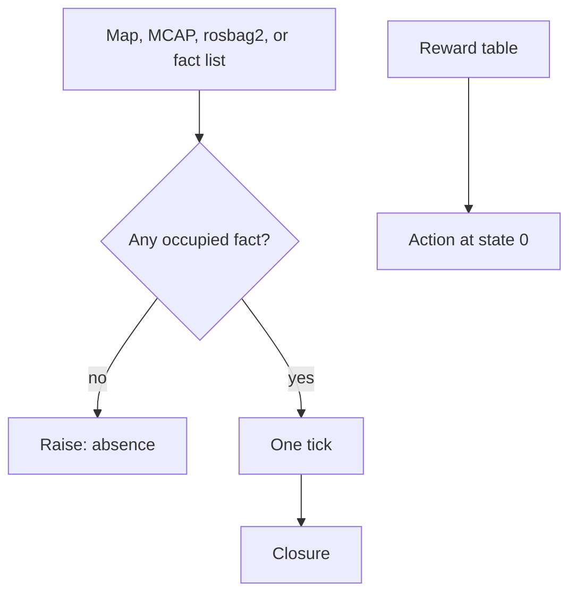

# Worldtick · 世界一步

[](https://github.com/shaneraphel/aletheia-worldtick/actions/workflows/check.yml)

Fact reachability for one discrete tick of a world. An empty fact tape is absence.

世界的一步可达性。空的事实磁带是缺席。

Autonomy software reads the world from a map, a bag, or a graph. When that tape is empty — a dropout, a blank grid, a log with no messages — a reader that returns zero tells the downstream planner the world is clear. Worldtick raises. The kernels on this path are exact integer programs. This path has no trained weights and no gradient steps.

自主系统从地图、数据包或图里读世界。磁带是空的时候（传感器掉线、空白栅格、没有消息的日志），一个返回 0 的读取器会让下游规划器以为世界是空旷的。Worldtick 在这里抛出异常。这条路径上的内核是精确整数程序，没有训练出来的权重，也没有梯度步。

## Where the upstream result changes / 上游的返回值在哪里分开

These repositories are not forked. On one tape their function returns an empty list, `0`, `0.0`, or `nan`. The kernel here raises, and the occupied tape keeps its old number.

这些上游仓库没有被分叉。同一条磁带上，他们的函数返回空列表、`0`、`0.0` 或 `nan`。这里的内核抛出异常，有内容的磁带仍是原来的数。

### Dexterous hand / 灵巧手


[MuJoCo 3.13.0](https://github.com/google-deepmind/mujoco) loads an empty `<worldbody/>`. [munkres 1.1.4](https://github.com/bmc/munkres) `compute([[]])` returns `[]` ([their note](https://github.com/bmc/munkres/issues/54)). `read_mjcf_cost` on a cost-free MJCF raises. `hungar_cost([])` raises. The checked-in 2×2 grasp stays cost **2**. Two fingers: [NumPy 2.4.6](https://github.com/numpy/numpy) `norm([])` is `0.0`, and `minimum_distance("")` raises, while `CAKE` stays distance **3**.

[MuJoCo 3.13.0](https://github.com/google-deepmind/mujoco) 会载入空的 `<worldbody/>`。[munkres 1.1.4](https://github.com/bmc/munkres) 对 `compute([[]])` 返回 `[]`（[他们的记录](https://github.com/bmc/munkres/issues/54)）。没有代价数字的 MJCF，`read_mjcf_cost` 抛出异常。`hungar_cost([])` 抛出异常。仓库里的 2×2 抓取代价仍是 **2**。两指：[NumPy 2.4.6](https://github.com/numpy/numpy) 的 `norm([])` 是 `0.0`，`minimum_distance("")` 抛出异常，而 `CAKE` 的距离仍是 **3**。

Kernel / 内核：[`locks/aletheia-handlock`](locks/aletheia-handlock) · [`locks/aletheia-fingerlock`](locks/aletheia-fingerlock)

### Brain-computer interface / 脑机接口


[MNE-Python 1.9.0](https://github.com/mne-tools/mne-python) builds an empty `RawArray` with `n_times = 0` and an empty annotation list of length 0. [NumPy 2.4.6](https://github.com/numpy/numpy) `mean([])` is `nan`. An empty trial type, an empty GDF, and `nyquist([])` raise here. The checked-in tape still has **8** samples and markers `go` / `end`. A rate of 0 stays a stored sample. [pybloom-live 4.0.0](https://github.com/joseph-fox/python-bloomfilter) reports membership `False` on a filter with no keys. `bloom_maybe([], 16, 2, 2)` raises.

[MNE-Python 1.9.0](https://github.com/mne-tools/mne-python) 的空 `RawArray` 是 `n_times = 0`，空标注列表长度是 0。[NumPy 2.4.6](https://github.com/numpy/numpy) 的 `mean([])` 是 `nan`。空的 trial type、空的 GDF，以及 `nyquist([])`，在这里抛出异常。仓库里的磁带仍是 **8** 个采样，标记仍是 `go` / `end`。速率 0 仍是一条存着的采样。[pybloom-live 4.0.0](https://github.com/joseph-fox/python-bloomfilter) 对没有键的过滤器给出成员关系 `False`。`bloom_maybe([], 16, 2, 2)` 抛出异常。

Kernel / 内核：[`locks/aletheia-spikelock`](locks/aletheia-spikelock) · [`locks/aletheia-bloomlock`](locks/aletheia-bloomlock)

### Mobile robot / 移动机器人


[NetworkX 3.6.1](https://github.com/networkx/networkx) on an empty `DiGraph` has no nodes, and `descendants` on the 3-node chain reaches 3. `datalog_fixpoint(3, [], edges)` raises while those edges are still present. On the checked-in 1×3 occupancy map, `world_tick` reaches **2** and the closure reaches **3**. On the pinned 256-node world the same split is **24** then **214**.

[NetworkX 3.6.1](https://github.com/networkx/networkx) 的空 `DiGraph` 没有节点，3 节点链上的 `descendants` 到达 3。边还在的时候，`datalog_fixpoint(3, [], edges)` 抛出异常。仓库里的 1×3 占据图，`world_tick` 到达 **2**，闭包到达 **3**。固定的 256 节点世界上，这两个数是 **24** 和 **214**。

Kernel / 内核：[`occgrid.py`](occgrid.py) · [`tick.py`](tick.py) · [`datalog.py`](datalog.py)

### Vehicle / 车


[NumPy 2.4.6](https://github.com/numpy/numpy) `linalg.norm([])` is `0.0`. [FilterPy 1.4.5](https://github.com/rlabbe/filterpy) `update(None)` is accepted and leaves `x0 = 0.0`. `octpart_ne([], 1, 1, 1)` raises, and two lidar points still occupy the north-east child (**1**). `kalman_filter([])` raises, and three real observations still occupy **3**. An empty road graph in [NetworkX](https://github.com/networkx/networkx) has no nodes. `shortest_path_visit([])` raises.

[NumPy 2.4.6](https://github.com/numpy/numpy) 的 `linalg.norm([])` 是 `0.0`。[FilterPy 1.4.5](https://github.com/rlabbe/filterpy) 的 `update(None)` 被接受，`x0` 留在 `0.0`。`octpart_ne([], 1, 1, 1)` 抛出异常，两个雷达点仍占据东北子节点（**1**）。`kalman_filter([])` 抛出异常，三条真实观测仍占据 **3**。[NetworkX](https://github.com/networkx/networkx) 的空路网没有节点。`shortest_path_visit([])` 抛出异常。

Kernel / 内核：[`locks/aletheia-voxelock`](locks/aletheia-voxelock) · [`locks/aletheia-kalmanlock`](locks/aletheia-kalmanlock) · [`locks/aletheia-tourlock`](locks/aletheia-tourlock)

## Highlights / 高光

1. **Absence raises.** An empty fact list, a negative world width, a blank occupancy grid, an MCAP log with zero messages, a rosbag2 folder with zero messages, and an empty reward table all raise.

   **空则报错。** 空事实表、负的世界宽度、空白占据栅格、零消息的 MCAP、零消息的 rosbag2、空奖励表，都会抛出异常。

2. **One tick is a different number from the closure.** On the checked-in 1×3 occupancy map, one tick reaches **2** cells and the closure reaches **3**. On the pinned 256-node world (seed `20260919`, 8 facts, 512 edges), one tick reaches **24** nodes and the closure reaches **214**. Walking 256 ticks meets the closure.

   **一步和闭包是两个数。** 仓库里的 1×3 占据图，一步到达 **2** 格，闭包到达 **3** 格。固定的 256 节点世界（种子 `20260919`，8 条事实，512 条边）一步到达 **24** 个节点，闭包到达 **214**。走满 256 步之后与闭包相同。

3. **The planned action can disagree with the greedy row.** On a 2-state reward table, the current row picks action **0** and policy iteration picks action **1**. On the pinned 256×8 table, the greedy row picks **2** and iteration picks **5**, on two walks.

   **规划动作可以和贪心行不一致。** 两状态奖励表上，当前行选择动作 **0**，策略迭代选择动作 **1**。固定的 256×8 表上，贪心行选择 **2**，迭代选择 **5**，走两遍相同。

4. **The same rule on logs stacks already write.** ROS map_server YAML + PGM, Foxglove MCAP, ROS 2 rosbag2 (sqlite3), and a NetworkX 3.6.1 run on the same 3-node world. NetworkX reports an empty node set. This kernel raises while the edges are still present.

   **同一条规则落在现成日志上。** ROS map_server 的 YAML + PGM、Foxglove MCAP、ROS 2 rosbag2（sqlite3），以及同一张 3 节点图上的 NetworkX 3.6.1。NetworkX 给出空节点集。边还在的时候，这个内核抛出异常。

5. **A reviewer can recompute the claim.** `make check` reruns the identities. GitHub Actions runs that check on every push. The counts below are copied from `results/`.

   **审阅者可以重算这些结论。** `make check` 会重跑这些恒等式。每次推送都会跑 GitHub Actions。下面的数字抄自 `results/`。

6. **The format index is in this repo.** 66 lock kernels and 100 binds cover tapes those stacks write — occupancy, MCAP, NIfTI, BIDS-EEG, OpenDRIVE, and the rest. The index is [`ATLAS.md`](ATLAS.md).

   **格式索引就在这个仓库里。** 66 个 lock 内核和 100 个 bind 覆盖这些系统已经在写的磁带，包括占据栅格、MCAP、NIfTI、BIDS-EEG、OpenDRIVE。索引见 [`ATLAS.md`](ATLAS.md)。



## Related open source / 相关开源项目

These are the projects the kernels read, write, or run side by side. The URL is the upstream project.

这些是内核在读、在写、或并排运行的上游项目。

| Project 项目 | URL | Where it meets this repo 在本仓库中的位置 |
|---|---|---|
| NetworkX | https://github.com/networkx/networkx | Same 3-node world in `show_networkx.py`. 同一张 3 节点图。 |
| Foxglove MCAP | https://github.com/foxglove/mcap | Occupancy samples in `mcapocc.py`. 占据采样。 |
| ROS 2 rosbag2 | https://github.com/ros2/rosbag2 | Bag folder in `bagocc.py`. 数据包目录。 |
| rosbags | https://gitlab.com/ternaris/rosbags | Reader used by `show_rosbags.py`. 读取器。 |
| ROS map_server | https://wiki.ros.org/map_server | YAML + PGM occupancy map. 占据图。 |
| nav_msgs/OccupancyGrid | https://docs.ros.org/en/humble/p/nav_msgs/interfaces/msg/OccupancyGrid.html | Cell values ingested by `occgrid.py`. 栅格数值。 |
| ROS 2 | https://github.com/ros2/ros2 | The stack those bags and maps come from. 这些包和地图所属的系统。 |
| Soufflé | https://github.com/souffle-lang/souffle | Systems Datalog. `datalog.py` is a positive-fact reachability fixpoint on one pinned world. 系统化 Datalog。本仓库的 `datalog.py` 是固定世界上的正事实可达闭包。 |
| NumPy | https://github.com/numpy/numpy | Side-by-side runs inside `locks/`. `locks/` 里的并排运行。 |
| MNE-Python | https://github.com/mne-tools/mne-python | EDF, GDF, and BIDS-EEG tapes in the lock kernels. 脑电磁带。 |
| BIDS | https://github.com/bids-standard/bids-specification | BIDS-EEG sidecars. 脑电旁车文件。 |
| NiBabel | https://github.com/nipy/nibabel | NIfTI volumes named in the atlas. 图谱中的 NIfTI。 |
| ASAM OpenDRIVE | https://github.com/asam-oss/asamOpenDRIVE | Junction maps in the lock kernels. 路口地图。 |
| MuJoCo | https://github.com/google-deepmind/mujoco | MJCF bodies in the lock kernels. MJCF 刚体。 |
| Open3D | https://github.com/isl-org/Open3D | Point clouds in the lock kernels. 点云。 |
| nuScenes devkit | https://github.com/nutonomy/nuscenes-devkit | Sample tables in the lock kernels. 样本表。 |
| pyahocorasick | https://github.com/WojciechMula/pyahocorasick | Suffix-link comparison in stemlock. 后缀链接对照。 |
| python-bloomfilter | https://github.com/joseph-fox/python-bloomfilter | Bloom membership comparison in bloomlock. Bloom 成员对照。 |

## Run / 运行

```bash
make check
python3.12 show_tick.py
python3.12 show_policy.py
python3.12 show_networkx.py
python3.12 tick_bench.py
python3.12 datalog_bench.py
python3.12 policy_bench.py
```

Show dependencies (NetworkX, MCAP, rosbags) are pinned in `requirements-show.txt`. The precision check uses the standard library only.

演示依赖（NetworkX、MCAP、rosbags）钉在 `requirements-show.txt`。精度检查只用标准库。

## Pinned replay / 固定回放

Copied from `results/TICK_EVIDENCE.json` and `results/DATALOG_EVIDENCE.json`.

数字抄自 `results/TICK_EVIDENCE.json` 与 `results/DATALOG_EVIDENCE.json`。

| field 字段 | value 值 |
|---|---|
| python | CPython 3.12.8 |
| platform 平台 | macOS-26.2-arm64 |
| seed 种子 | 20260919 |
| world 世界 | 256 nodes, 8 facts, 512 edges |
| one tick 一步 | 24 |
| closure, twice 闭包，两遍 | 214 |
| closure after 256 ticks 走满 256 步 | 214 |

Copied from `results/POLICY_EVIDENCE.json` and `results/SHOW_POLICY.json`.

数字抄自 `results/POLICY_EVIDENCE.json` 与 `results/SHOW_POLICY.json`。

| field 字段 | value 值 |
|---|---|
| 2-state table, greedy / iterated 两状态，贪心 / 迭代 | 0 / 1 |
| 256 states × 8 actions, greedy 贪心 | 2 |
| 256 states × 8 actions, iterated, twice 迭代，两遍 | 5 |
| `policy_iteration` median 中位数 | 0.00597583397757262 s |
| row-0 greedy median 第 0 行贪心中位数 | 9.832961950451136e-06 s |

The Datalog closure on this world matches a BFS reach count of 214. Median times from `results/DATALOG_EVIDENCE.json`: fixpoint 0.0003089579986408353 s, BFS 0.0001294169924221933 s.

这张世界上的 Datalog 闭包与 BFS 可达数同为 214。中位时间见 `results/DATALOG_EVIDENCE.json`：闭包 0.0003089579986408353 秒，BFS 0.0001294169924221933 秒。

## What is in the box / 目录

| path 路径 | role 作用 |
|---|---|
| `tick.py` | one tick, and reachability after a horizon. 一步，以及给定步数后的可达。 |
| `datalog.py` | closure of the same facts. 同一批事实的闭包。 |
| `policy.py` | integer policy iteration; an empty table raises. 整数策略迭代；空表抛出异常。 |
| `occgrid.py` | ROS occupancy YAML + PGM, then a 4-connected graph. 占据图，再连成四邻接图。 |
| `mcapocc.py` | Foxglove MCAP occupancy samples. MCAP 占据采样。 |
| `bagocc.py` | ROS 2 rosbag2 folder. rosbag2 目录。 |
| `tests/test_precision.py` | the identities above. 上面的恒等式。 |
| `results/` | pinned JSON from the runs. 运行结果。 |
| `locks/` | 66 format kernels. 66 个格式内核。 |
| `binds/` | 100 binds. 100 个 bind。 |
| `ATLAS.md` | the index. 索引。 |

## Atlas / 索引

66 lock kernels, 100 binds, 10 resource lists, and 6 tools live under `locks/`, `binds/`, `docs-awesome/`, and `tools/`. The index is [`ATLAS.md`](ATLAS.md).

66 个 lock 内核、100 个 bind、10 份资源清单和 6 个工具在 `locks/`、`binds/`、`docs-awesome/` 和 `tools/`。索引是 [`ATLAS.md`](ATLAS.md)。

## License / 许可

MIT
