# Worldtick

[](https://github.com/shaneraphel/aletheia-worldtick/actions/workflows/check.yml)

A boundary in front of a world model, a neural decoder, or a planner. Cells that were not observed stay unobserved. Empty input is refused, and does not come back as zero.

放在世界模型、神经解码器或规划器前面的一道边界。没观测到的格子保持没观测到。空输入被拒绝，不会变成 0。

可以打开的页面：[shaneraphel.github.io/aletheia-worldtick](https://shaneraphel.github.io/aletheia-worldtick/)。

这页在讲一件事。世界模型要交回一幅完整的画面，脑电解码要交回一个类别，灵巧手的引导要交回一只已经摆好的手。没测到的地方一旦被写成一个能用的值，下一模块就会把它当成测到的。我们把这次写入挡住。空的声音文件、空白的图、没有点的扫描，库都会交出来；会话不把它们读成“人是平静的”或“手已经抓完”。

This page is about one action. A world model is asked for a finished picture, a neural decoder is asked for a class, and a hand coach is asked for a pose that has already happened. Once an unmeasured place is written as a usable value, the next module treats it as measured. We stop that write. An empty sound file, a blank image, and a scan with no points are all objects the libraries return. The session does not read them as “the person is calm” or “the hand has finished the grasp.”

## How to read this

Read in this order. The page is the product. This file is the reason the product is shaped that way. The proofs are a separate note.

1. Open the page and press the three buttons on the corridor, then the EEG window, then the reward row. Do this before reading any count.
2. If a word is unfamiliar, use the list below. The same word means the same thing in the page, in this file, and in the note.
3. Read where shipped products get stuck, then where common libraries still return a number. That is the problem the page is for.
4. Read why a check in front of the model is enough. The counts there are witnesses of those statements, not a separate result.
5. The proofs, and the comparison with each cited method, are in [`paper/paper.md`](paper/paper.md).

按这个顺序读。页面是产品。这份文件说明产品为什么是这个形状。证明在另一份笔记里。

1. 先打开页面，按走廊上的三个按钮，再看脑电窗口，再看奖励表。在看任何计数之前做完这一步。
2. 有不认识的词，用下面的名单。同一个词在页面、这份文件和笔记里是同一个意思。
3. 再读业界产品卡在哪里，以及常用的库为什么仍会交回一个数。那就是这个页面要处理的问题。
4. 再读为什么模型前面的一道检查就够。那里的计数是这些陈述的见证，不是另一项结果。
5. 证明，以及和每篇参考文献的方法对照，在 [`paper/paper.md`](paper/paper.md)。

A team funded to ship a video world model spends the work on data, training, and a robot test. That is the generator. This repository ships the check in front of the generator. The two do not share a schedule, because they are not the same product. The check is a page and a library call. It does not train anything, and it does not claim the generator's robot score.

拿融资去做视频世界模型的团队，时间花在数据、训练和机器人测试上。那是生成器。本仓库交付的是生成器前面的检查。两件事不是同一张时间表，因为它们不是同一个产品。检查是一个页面和一次库调用。它不训练，也不声称自己有生成器的机器人分数。

We do not post the page on another project's issue tracker. Those issues are for defects in that project. A comment that is really a product announcement gets removed, and it should. When a library has an empty-input defect we can fix with a test, the contribution is a pull request.

我们不把页面发到别的项目的 issue 里。那些 issue 是为了那个项目自己的缺陷。一条实际内容是产品公告的评论会被删掉，也应该被删掉。某个库在空输入上确有缺陷、而且我们能用测试修好时，贡献的形式是一个 pull request。

## Words

| Word | Meaning |
|---|---|
| Partial observation | Some entries of the input were not measured. They are not the same thing as a measured zero. |
| Fill, imputation | Writing a usable value into an entry that was not measured, then treating the result as if it had been measured. |
| Optimistic fill | The written value is “free” on a map, or zero on a signal. The hole disappears. |
| Pessimistic fill | The written value is “blocked.” The planner may not enter a cell it did not see. |
| Measured step | A transition that uses only entries that were actually observed. An unseen cell is not entered. |
| Mask | The mark that an entry was not observed. A fill deletes this mark. After the fill, a checker that looks for the mark finds nothing. |
| Empty input | An input with nothing in it. Here it is refused. It is not returned as zero, as an empty list, or as not-a-number. |
| Tie | Two plans with the same length. On a tie, the shipped decision keeps the plan that uses only observed free cells. |
| Oracle | A score that knows which plan hits a real obstacle. It is a reference, not a sensor the product has at deployment. |
| Discount `9/101` | The point at which one backup changes the action on the trap table. Below it, the visible row wins. Above it, the backup wins. |
| Fixed point | The set of everything reachable if the walk is allowed to finish. One step is a smaller set. Returning the fixed point in one call reports the finished walk as the present. |
| One question | Blocking the first cell where the filled path crashes, then planning again. It does not repair the other unseen cells. |
| Closed loop | Observing again before every step, instead of trusting the rest of the fill. |
| Scene hold | The music and the picture stay as they are, because the brain window was incomplete. A class computed after filling that window is not allowed to change them. |
| Bilateral sound | Alternating left-right sound, the sensory part of an EMDR session. This repository does not claim a treatment effect. The rule is when that sound may change. |
| Grasp picture | The 3D picture of a dexterous hand in the scene. It may not show a finished grasp through a cell the camera did not see. |
| Closed finger | Joint code 0. A missing sample is not this code. |
| Zero buffer | A missing joint sample stored as 0, so the picture draws that finger closed. |
| Silent file | A sound file with zero frames. Players open it. The session does not treat it as rest. |
| Empty cloud | A point cloud or mesh with nothing in it. Geometry libraries return it. The session does not treat it as a finished hand. |

| 词 | 意思 |
|---|---|
| 部分观测 | 输入里有些项没有测到。它们不是“测到了零”。 |
| 补全 | 给没测到的项写上一个能用的值，然后把结果当成测到的。 |
| 乐观补全 | 在地图上写成空地，在信号上写成零。洞消失了。 |
| 悲观补全 | 写成挡住。规划器不能进入没看见的格子。 |
| 实测步 | 只用真正观测到的项做一次转移。没看见的格子不进入。 |
| 掩码 | “这一项没观测到”的标记。补全会删掉这个标记。补完之后，寻找这个标记的检查什么也找不到。 |
| 空输入 | 里面什么都没有的输入。这里直接拒绝。不返回零，不返回空列表，也不返回非数。 |
| 平局 | 两条路一样长。平局时，交出去的决策留下只走已观测空地的那条。 |
| 先知 | 知道哪条路会撞上真障碍的分数。它是参照，不是产品在部署时拥有的传感器。 |
| 折扣 `9/101` | 在陷阱表上，一次回溯改变动作的那个点。低于它，当前行赢。高于它，回溯赢。 |
| 不动点 | 如果把路走完，所有能到达的位置。一步比它小。一次调用就返回不动点，是把走完的路当成了现在。 |
| 一次追问 | 封住补全路径第一次撞上的格子，再规划一次。它不修理其余没看见的格子。 |
| 闭环 | 每走一步之前再观测一次，而不是相信补全剩下的部分。 |
| 画面保持 | 音乐和画面维持原样，因为脑电窗口不完整。用补全后的类别去改它们，是不允许的。 |
| 双侧声音 | 左右交替的声音，是 EMDR 里的感觉部分。本仓库不声称治疗效果。规则只规定这段声音什么时候可以变。 |
| 抓取画面 | 灵巧手在场景里的三维画面。它不能把摄像机没看见的格子画成一次已经完成的抓取。 |
| 闭合的手指 | 关节代码 0。没到的采样不是这个代码。 |
| 零缓冲 | 把没到的关节采样存成 0，于是画面把这根手指画成闭合。 |
| 无声文件 | 帧数为 0 的声音文件。播放器会打开它。会话不把它当成静息。 |
| 空点云 | 里面没有点的点云或网格。几何库会把它交回来。会话不把它当成一只已经成形的手。 |

## Two people, one picture

The page is aimed at two groups, and both are injured by the same write.

**Someone adapting to a dexterous hand.** The world model is there to show the hand in the scene, in real time, so the person can see a reach before the hand has finished it. The failure is a picture of a grasp that passes through a cell the camera did not see. The person then practices a motion the world does not contain. On 2,000 maps the filled picture does this 1,439 times. The coach draws that completed grasp 0 times.

**Someone staying with a bilateral sound.** EMDR pairs recall with a left-right sound. The practical difficulty is that the sound is hard to stay with, so the game is an open place where that sound can continue, and where other people are present at low demand. A world model can also be asked to change the sound and the picture when a brain window looks frightened. If that window was incomplete and then filled with zeros, the change is not a reading of fright. On 10,000 signed windows with the last 4 samples dropped, a zero-fill would retune 2,421 of them: 1,280 movements read as rest, and 1,141 rests read as movement. The session holds all 10,000. It does not claim that holding treats anyone.

**What you can hear.** Open the page and press “play the left-right sound.” Clicks alternate between the left ear and the right ear. A complete window may set the speed: **2** clicks a second when the recorded sum is not positive, **6** when it is. Press “drop the window” and the speed stays where it is. On 10,000 such steps, a window was dropped **3,057** times. A zero-fill would have switched to the other speed on **712** of those steps. The speed already playing changed **0** times while a window was dropped. When the window was complete, the speed was allowed to follow it, and it changed on **3,379** steps. This is not a reading of fright. Nothing here detects a panic, and nothing here claims to treat one. The sound is the part a person can stay with. The rule is when it may change.

**你能听到的。** 打开页面，按“播放左右交替的声音”。点击在左耳和右耳之间交替。窗口完整时，速度可以设定：实录的和不是正数时，每秒 **2** 下；是正数时，每秒 **6** 下。按“丢掉这个窗口”，速度停在原来的地方。10,000 步里，窗口被丢掉 **3,057** 次。补零会在其中 **712** 步改成另一个速度。窗口被丢掉的时候，正在响的速度改变了 **0** 次。窗口完整时，速度允许跟着实录走，这样的改变有 **3,379** 步。这不是对惊恐的读取。这里没有检测惊恐发作，也没有声称在治疗。声音是人可以留下来听的那一部分。规则只规定它什么时候可以变。

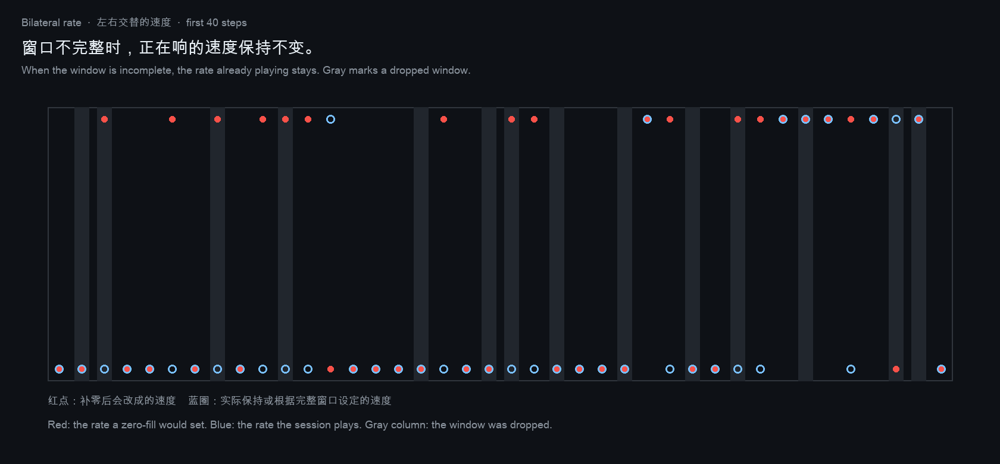

**What you see.** The hand in the picture is drawn only as far as the camera has seen, and only on cells that were free. On the same 2,000 maps that drawn part is **6,657** cells and contains **0** obstacles. The filled path keeps going for another **53,456** cells. **2,474** of those are real obstacles. On **1,938** maps the filled picture would have drawn past the camera. One core and ten cores count the same cells. The other people in the room stand still. They are the low-demand place: present, not a route, and not a score. The picture does not walk the hand through them, and it does not walk the hand through a cell the camera did not see. When the brain window drops, the picture holds on the same frame, just as the sound holds its rate.

**你看见的。** 画面里的手只画到摄像机已经看见的地方，而且只画在当时是空地的格子上。同一批 2,000 张地图，画出来的部分是 **6,657** 个格子，里面的障碍是 **0**。补全后的路径还要再走 **53,456** 个格子，其中 **2,474** 个是真障碍。**1,938** 张地图上，补全后的画面会画过摄像机看见的最后一格。一个核和十个核数到的格子相同。房间里的其他人站着不动。他们是那个低消耗的地方：在场，但不是一条要走的路，也不是一个分数。画面不把手穿过他们，也不把手穿过摄像机没看见的格子。脑电窗口丢掉时，画面停在同一帧，和声音把速度留在原地是同一条规则。

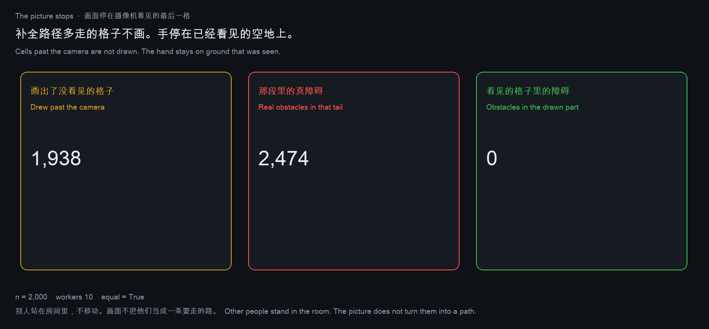

**What the coach may say.** A complete window with a positive sum is an attempt: the left-right rate may become 6 a second. If the next cell was not seen, the picture does not take that step. The person can hear that the attempt arrived. The hand stays. On 2,000 maps, each with one window, this pair happens **630** times. The window was dropped on **572** maps, and then both the sound and the picture hold. A movement with the next cell actually seen happens **22** times. Only then may the picture advance. The other **776** complete windows are not movements. One core and ten cores agree. A fill would have drawn those 630 unseen steps as finished grasps. The coach does not. This is not a mood and not a diagnosis. The window was complete, and the cell was not seen. Both of those were observed.

**教练可以说的。** 一个完整窗口、采样之和为正，是一次尝试：左右声可以变成每秒 6 下。如果下一格没被看见，画面不走这一步。人可以听见这次尝试到了。手留在原地。2,000 张地图各配一个窗口，这种配对出现 **630** 次。窗口被丢掉的有 **572** 张，那时声音和画面都保持。动作而且下一格确实看见了的，有 **22** 次。只有这时画面可以前进。其余 **776** 个完整窗口不是动作。一个核和十个核一致。补全会把那 630 步没看见的格子画成已经抓完。教练不这么画。这不是心情，也不是诊断。窗口是完整的，格子没有被看见。这两件事都是观测到的。

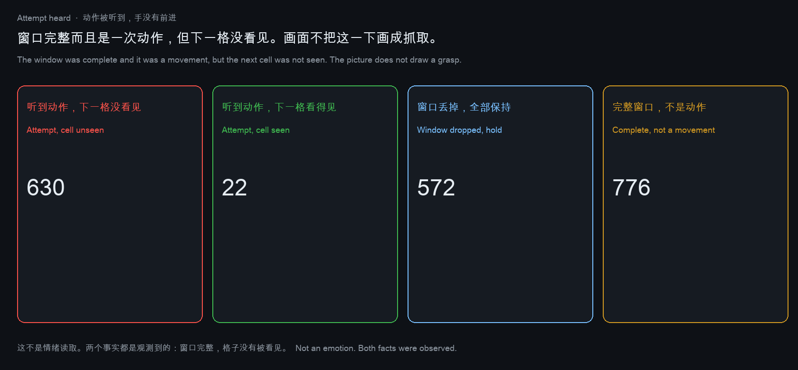

**What is kept.** Each map can leave one row. A dropped window does not store a class. The hand's cell is the last place the camera saw, and that place was free. On these 2,000 rows, **1,428** classes are stored, one for every complete window and none for a dropped window. A class written onto a drop is **0**. A hand cell that was not seen is **0**. The **630** steps that were heard but not seen are stored as refused, not as finished grasps. One core and ten cores write the same counts. This is not data taken from a person. It is the shape a record is allowed to have: useful for practicing the hand, and for the sound that stayed, without a diagnosis inside it.

**留下的。** 每张地图可以留下一行。丢掉的窗口不记类别。手的格子是摄像机最后看见的地方，而且那里是空地。这 2,000 行里记下 **1,428** 个类别，每个完整窗口一个，丢掉的窗口一个都没有。把类别写进丢包的次数是 **0**。手落在没看见的格子上的次数是 **0**。那 **630** 步被听到、却没被看见的，记成拒绝，不记成已经抓完。一个核和十个核写下的计数相同。这不是从人身上采来的数据。这是记录允许长成的形状：可以用于练手，也可以用于那段留下来的声音，里面没有诊断。

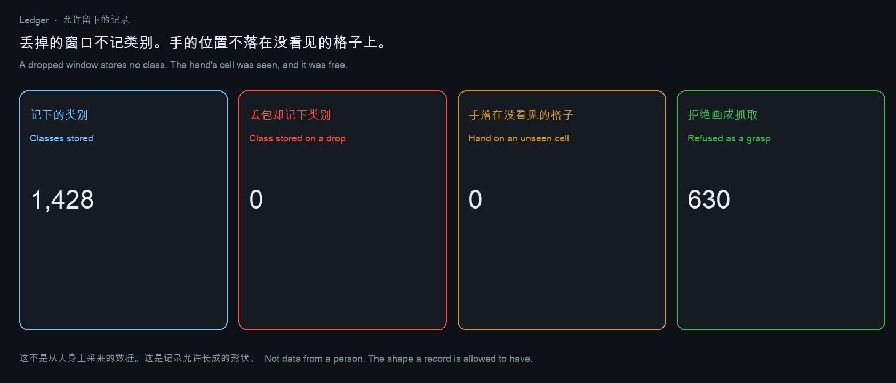

**Who is in the room.** Two people stand on every map, at the same two cells, (4, 4) and (8, 8). They do not move. The hand is not sent to them. A person is drawn only if that cell was seen. Of 4,000 person-cells, **3,003** were seen and **997** were not, so those 997 are not in the picture. The filled path walks through an unseen person **19** times. The path that stays on seen cells walks through a seen person **2** times. Those 19 crossings are there because a missing cell was written free. One core and ten cores agree. The room does not become safer or more social by drawing people the camera did not see.

**谁在房间里。** 两个人站在每张地图的同一处，(4, 4) 和 (8, 8)。他们不移动。手也不被派去找他们。一个人只有在那一格被看见时才画出来。4,000 个人格里，**3,003** 个被看见，**997** 个没有，所以这 997 个不在画面里。补全后的路径穿过没看见的人 **19** 次。只走已看见格子的路径，穿过一个已经被看见的人 **2** 次。这 19 次穿过，是因为没看见的格子被写成了空地。一个核和十个核一致。把摄像机没看见的人画进来，房间不会因此更安全，也不会因此更适合待着。

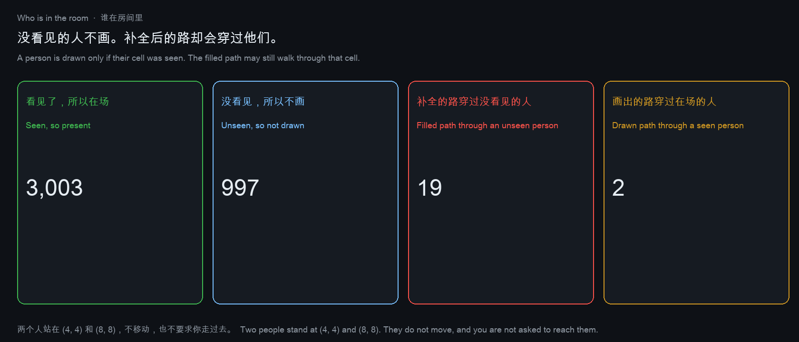

**The next frame.** The picture is a frame of pixels. Paint a cell only if it was seen, and put the hand on the last seen free cell. Paint that frame again, with no new observation: on all 2,000 maps the pixels match. The count of frames that changed on a repaint is **0**. Paint the missing cells too: the frame differs on all **2,000** maps, and **127,697** unseen cells receive a color. The picture moved because the fill wrote into cells the camera did not see. One core and ten cores get the same pixels. An example of the two frames is below: the left one holds, the right one fills.

**下一帧。** 画面是一帧像素。一格只有被看见才上色，手放在最后一格看见的空地上。没有新的观测，把这一帧再画一次：2,000 张地图的像素都相同。再画时像素发生变化的次数是 **0**。把没看见的格子也涂上：帧在全部 **2,000** 张地图上都不一样，**127,697** 个没看见的格子得到了颜色。画面动了，是因为补全写进了摄像机没看见的格子。一个核和十个核得到同样的像素。下面左边是保持的那一帧，右边是补全的那一帧。

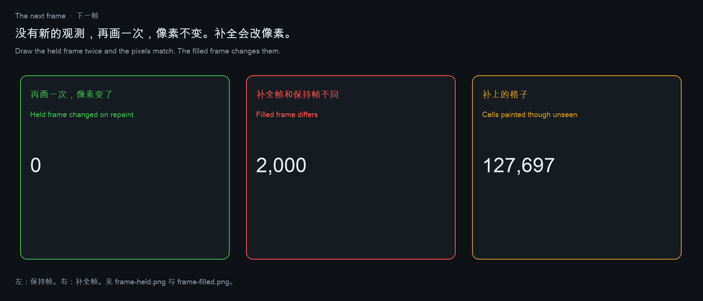

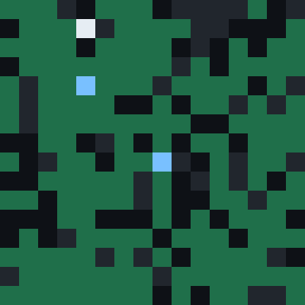
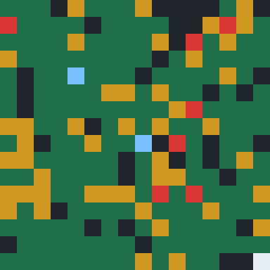

**One clock.** Sixteen windows arrive on each map. If the window is dropped, the rate does not change and the frame does not change. Both of those counts, over 2,000 maps, are **0**. The picture steps **3,665** times, and only when the window is a movement and a seen cell is still in front of the hand. The rate may follow a complete window after that, and it changes **10,933** times. Once the seen cells are used up, a movement is still heard **6,414** times, and the picture does not step. The sound continues. The camera has nothing new to draw. One core and ten cores agree.

**一个时钟。** 每张地图上来十六个窗口。窗口丢掉时，速度不变，帧也不变。2,000 张地图上，这两件事的次数都是 **0**。画面向前 **3,665** 次，而且只在窗口是一次动作、手前面还有看见的格子时。速度在看见的格子用完之后仍可以跟着完整窗口走，这样的改变有 **10,933** 次。路走完以后，动作仍被听到 **6,414** 次，画面不再向前。声音还在。摄像机没有新的东西可画。一个核和十个核一致。

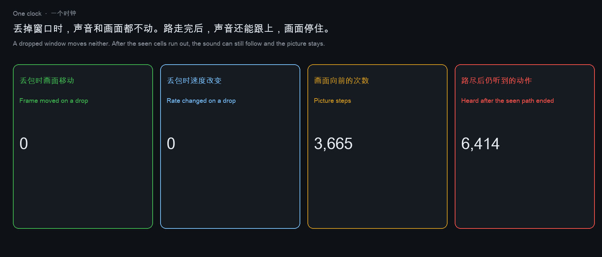

**How far someone is.** The two people stay at (4, 4) and (8, 8). The hand starts at the last cell the camera saw to be free. One walk may enter only cells that were observed free. The other walk treats a missing cell as free. The second walk reaches a person the first walk cannot reach **2,301** times. When both walks arrive, the filled walk is strictly shorter **560** times, out of **1,192** arrivals by both. The people do not move, and the hand is not sent to them. The shorter number is what a filled picture would call nearby. It is shorter because it crosses cells the camera did not see. One core and ten cores agree.

**离别人有多远。** 两个人仍站在 (4, 4) 和 (8, 8)。手从摄像机最后看见的那格空地出发。一条路只能进入已经观测为空的格子。另一条路把没看见的格子当成空地。第二条路能走到、第一条路走不到的人，有 **2,301** 次。两条路都能走到时，补全的那条严格更短 **560** 次，两条都能到的一共 **1,192** 次。人不动，手也不被派过去。更小的那个数，是补全画面会称作「近」的数。它更近，是因为它穿过了摄像机没看见的格子。一个核和十个核一致。

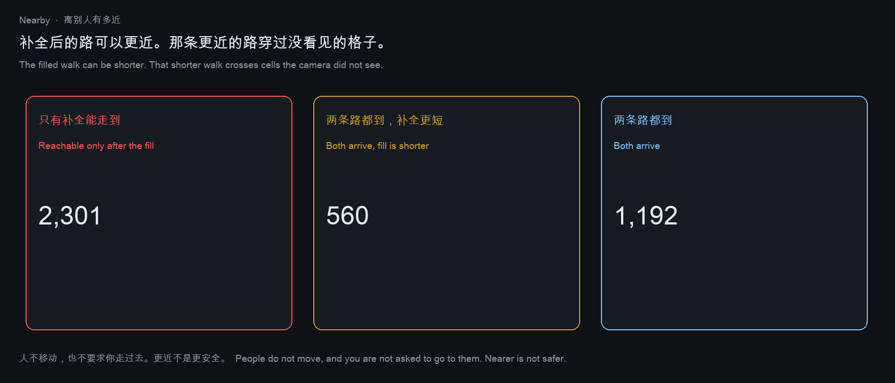

**The sound is not the picture.** The frame is the map the camera saw, plus the cell the hand stands on. The left-right rate is not drawn into those pixels. On the same 2,000 maps and the same sixteen windows, the pixels change **3,665** times. That is the same number as the picture steps. The rate changes while the picture stays **8,377** times. A dropped window changes the pixels **0** times. You can hear a different speed and still be looking at the same frame. One core and ten cores agree.

**声音不是画面。** 帧是摄像机看见的地图，加上手站着的那一格。左右声的速度不画进这些像素。同一批 2,000 张地图、同样的十六个窗口，像素改变 **3,665** 次，和画面向前的次数相同。速度变了、画面没变，有 **8,377** 次。丢掉的窗口让像素改变的次数是 **0**。你可以听见另一个速度，眼前仍是同一帧。一个核和十个核一致。

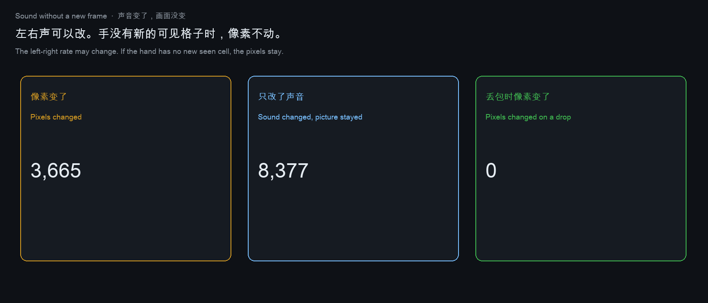

**A missing sample is not a closed finger.** Closed is joint code 0. Each finger either sends a code in 0…7, or the sample is missing, with probability 0.30. The coach keeps the last code that arrived. Before the first arrival it keeps nothing, and it does not draw the finger closed. The zero buffer writes 0 on every miss, so the picture closes a finger that was last seen open, and it also closes a finger that has never been seen. The question is how often that picture shows a closure the coach did not observe.

On 2,000 hands, sixteen packets, five fingers — 160,000 finger-steps, seed 20260919 — the buffer draws a closure the coach does not draw **43,014** times. **38,623** of those fingers were last seen open. **4,391** had never sent a sample. The coach draws **19,335** closures, and the buffer draws every one of them. A closure drawn by the coach without a received 0 happens **0** times. Five joints allocated as zeros read back as five zeros: a hand drawn closed before any packet. One core and ten cores agree. These are not angles from a person.

**没到的采样不是闭合。** 闭合是关节代码 0。每根手指要么送来 0 到 7 的代码，要么这次采样没到，概率是 0.30。引导保留上次真正到过的代码。第一次到达之前什么都不保留，也不把这根手指画成闭合。零缓冲在每次丢失时写上 0，于是画面会握上一根上次还张开的手指，也会握上一根从未到过采样的手指。问题是，这幅画面有多少次画出了引导没有测到的闭合。

2,000 只手、每只 16 个包、五根手指，共 160,000 步，种子 20260919。零缓冲画出引导没有画出的闭合，有 **43,014** 次。其中 **38,623** 次，这根手指上次看见时是张开的。**4,391** 次，这根手指一次采样都没到过。引导画出 **19,335** 次闭合，零缓冲把这 19,335 次全都画了。引导在没有收到 0 的情况下画出闭合，是 **0** 次。五个关节按零分配，读回来就是五个零：包还没到，手已经被画成握上。一个核和十个核一致。这些不是从人身上量到的角度。

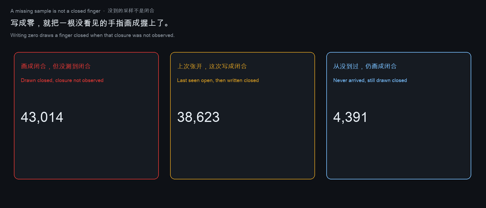

The world model is the picture. The non-invasive window is a partial observation. The hand camera is a partial observation. Filling either one, and then letting the picture move, is the same decision this repository already refuses on a map, on an EEG packet, and on a reward row.

一个人在适应灵巧手。世界模型用来把这只手画进场景，让人在手还没走完时看见这一下。失败的画面是一次抓取穿过了摄像机没看见的格子。人会按一幅世界里并不存在的动作去练。2,000 张图上，补全后的画面这样做了 1,439 次。引导把这种“已经抓完”画出来的次数是 0。

一个人留在一段双侧声音里。EMDR 把回忆和左右交替的声音放在一起。实际的困难是这段声音很难听下去，所以游戏是一个开放的地方，声音可以在那里继续，别人也可以在场，但不要求高消耗的社交。世界模型还可能被要求：脑电窗口看起来像惊恐时，就改声音和画面。如果那个窗口不完整，又被补成了零，这次改动就不是对惊恐的读取。10,000 个有符号窗口丢掉最后 4 个采样，补零会改掉其中 2,421 个：1,280 个动作被读成静息，1,141 个静息被读成动作。会话对这 10,000 个窗口全部保持。它不声称保持本身在治疗谁。

世界模型是那幅画面。非侵入窗口是一次部分观测。手上的摄像机也是一次部分观测。补上其中任何一个，再让画面动起来，就是本仓库在地图、脑电和奖励表上已经拒绝的同一个决策。


## Where shipped products get stuck

Three products share one stuck step. The model or the map is asked to return a complete scene, and the next module treats that scene as measured.

**World models.** [Cosmos](https://github.com/nvidia-cosmos/cosmos-predict1) and [V-JEPA 2.1](https://arxiv.org/abs/2603.14482) are used as “imagine the next frame, then act.” The frame that leaves the model has no holes. [Nilaksh et al.](https://arxiv.org/abs/2605.06388) showed that a latent can win on pixels and lose on the plan. [Yuan et al.](https://arxiv.org/abs/2609.24745) showed that an oracle, which sees the real outcome of each imagined future, lifts success from 68.9% to 79.2%, while selectors that score the picture recover little of that gap. The product difficulty is not drawing the future. It is that the drawn future no longer says which part was guessed. [Zhang et al.](https://arxiv.org/abs/2609.02159) make the same point from the other side: which future you keep changes the action.

**Brain–computer interfaces.** [LaBraM](https://arxiv.org/abs/2405.18765) predicts masked EEG, and [InterpolatedLaBraM](https://braindecode.org/dev/generated/braindecode.models.InterpolatedLaBraM.html) exists so a checkpoint always sees its training montage. A dropped packet written as zeros is classified as rest, the same class as a person who did not move. A clinical product then treats “the packet did not arrive” as “the user is at rest.”

**Robots and vehicles.** An occupancy map, a lidar filter, or a log player is expected to return a scene even when the sensor returned nothing. The planner then drives through a cell the sensor did not measure, because that cell now looks free.

三个产品卡在同一步。模型或地图被要求交回一幅完整场景，下一模块把这幅场景当成测到的。

世界模型这边，Cosmos 和 V-JEPA 2.1 的用法是“先想象下一帧，再行动”。交出去的画面没有洞。Nilaksh 等人说明，隐变量可以在像素上赢、在规划上输。Yuan 等人说明，能看到每个想象未来真实结果的先知，把成功率从 68.9% 抬到 79.2%，只给画面打分的选择器收不回这个差距。难点不是把未来画出来，而是画完之后看不出哪一块是猜的。Zhang 等人从另一侧说了同一件事：留下哪一个未来，动作就变了。

脑机接口这边，LaBraM 预测被遮住的脑电，InterpolatedLaBraM 保证检查点始终看到训练时的电极布局。丢失的数据包写成零，会被判成静息，和人没动是同一个类别。临床产品于是把“包没到”做成“用户在休息”。

机器人和车辆这边，占据栅格、激光滤波、日志回放都被期望在传感器没返回时仍交出一幅场景。规划器随后开过一个传感器没测到的格子，因为那个格子现在看起来是空的。


## Where widely used open source still gives a number

These libraries are the ones a robotics or biosignal stack actually calls. On the input they were built for, they are right. On empty input they return a value the next function will accept. That value is then a decision.

这些库是机器人栈和生物信号栈真的会调用的。在它们被设计来接受的输入上，它们是对的。在空输入上，它们返回一个下一函数愿意接受的值。这个值随后就成了决策。

| Project | What empty input returns | Why that is a product problem |
|---|---|---|
| [MuJoCo 3.13.0](https://github.com/google-deepmind/mujoco) | an empty model loads | a scene with no bodies is still a scene |
| [munkres 1.1.4](https://github.com/bmc/munkres) | `[]` on `compute([[]])` ([issue 54](https://github.com/bmc/munkres/issues/54)) | “no assignment problem” looks like “assignment finished” |
| [NumPy 2.4.6](https://github.com/numpy/numpy) | norm `0.0`, mean `NaN` | a missing vector looks like a zero vector, or like a number that propagates quietly |
| [MNE-Python 1.9.0](https://github.com/mne-tools/mne-python) | duration 0, zero annotations | a missing recording looks like a silent recording |
| [NetworkX 3.6.1](https://github.com/networkx/networkx) | an empty graph has 0 nodes | “no map was loaded” looks like “the map is empty, so you are done” |
| [FilterPy 1.4.5](https://github.com/rlabbe/filterpy) | an empty update is accepted and the state stays `0.0` | “no lidar return” looks like “the state is zero” |
| [Foxglove MCAP](https://github.com/foxglove/mcap) | a log with zero messages | playback continues on silence |
| [ROS 2 rosbag2](https://github.com/ros2/rosbag2) | a bag with zero messages | same, for the bag a robot records |
| [pybloom-live 4.0.0](https://github.com/joseph-fox/python-bloomfilter) | a keyless filter reports non-membership | “no key was given” looks like “the key is absent” |
| Python `wave` | a file with **0** frames is a legal sound | silence with a sample rate is still a sound the next player will open |
| [SciPy 1.17.1](https://github.com/scipy/scipy) | an empty array written as WAV comes back with shape `(0,)` at 8,000 Hz | a dropped bilateral tone is a readable file |
| [soundfile 0.14.0](https://github.com/bastibe/python-soundfile) | the same empty WAV reads as length 0 | same, for the library a game uses to play it |
| [Pillow 11.3.0](https://github.com/python-pillow/Pillow) | `Image.new` accepts a **0×0** RGB image | a world-model frame can exist with no pixels |
| [OpenCV 5.0.0](https://github.com/opencv/opencv) | an empty image has **0** nonzero pixels | “nothing was seen” looks like a counted zero |
| [Open3D 0.20.0](https://github.com/isl-org/Open3D) | an empty cloud has **0** points and an empty mesh has **0** vertices | a hand scan that did not arrive is still a geometry object |

The shortcoming is the same in each row. Absence is stored as a number. The next module cannot tell “nothing was measured” from “the measurement was zero.”

每一行的不足是一样的。缺失被存成一个数。下一模块分不出“什么都没测到”和“测到的是零”。

## What those two measurements are

Two questions, asked separately, because they are easy to mix together.

**Does a faster machine see a different world?** Take the same 2,000 maps, seed 20260919. One process plans every map. Ten processes plan disjoint slices of that same sequence, so each map is planned once. Count how often the filled path walks into a real obstacle. Both counts are **1,439**. The picture of the hand does not depend on which core drew it. A faster schedule is not a different product.

机器更快，会不会看见另一个世界？同一批 2,000 张地图，种子 20260919。一个进程规划全部地图。十个进程规划这条序列里互不重叠的片段，每张地图只规划一次。数一数补全后的路径走进真障碍的次数。两个数都是 **1,439**。手的画面不取决于哪一个核画的。更快的安排不是另一个产品。

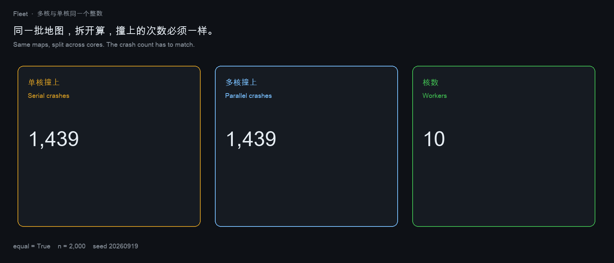

**When the sensor returns nothing, what does the library hand to the game?** A sound file, a picture, and a hand scan are the three objects this product stores. Python’s `wave` module writes a legal file with **0** frames. SciPy 1.17.1 and soundfile 0.14.0 read that file back as an array of length 0 at 8,000 Hz. Pillow 11.3.0 builds an image whose size is **0×0**. OpenCV 5.0.0 counts **0** nonzero pixels in an empty image. Open3D 0.20.0 returns a cloud with **0** points and a mesh with **0** vertices. Each call succeeds. The next module can play, show, or render the result.

传感器什么都没交回来时，库交给游戏的是什么？声音文件、画面、手部扫描，是这个产品要存的三样东西。Python 的 `wave` 能写出 **0** 帧的合法文件。SciPy 1.17.1 和 soundfile 0.14.0 把它读回成长度为 0、采样率 8,000 Hz 的数组。Pillow 11.3.0 能造出尺寸为 **0×0** 的图。OpenCV 5.0.0 在空图上数到 **0** 个非零像素。Open3D 0.20.0 交回 **0** 个点的点云和 **0** 个顶点的网格。这些调用都成功。下一模块可以播放、显示或渲染这个结果。

That success is the product problem. A file with a sample rate and no frames is not the same thing as a person at rest. A cloud that exists and contains no points is not a finished grasp. Eight real samples are a different object: they are class **1**, a movement, and they occupy **8** frames. A list with no samples is refused.

这次成功就是产品的问题。一个有采样率、却没有帧的文件，不是“人处于静息”。一个存在、却没有点的点云，不是一次已经完成的抓取。八个真实采样是另一个对象：类别是 **1**，一次动作，占 **8** 帧。一个没有采样的列表会被拒绝。


On the same empty inputs this repository raises. On the occupied input the value is unchanged: a 2×2 assignment stays cost 2, the string `CAKE` stays distance 3, a recorded EEG clip stays 8 samples with markers `go` and `end`, one lidar pair counts as 1, three observations count as 3, and a three-cell chain reaches 2 in one step and 3 at the fixed point.

同样的空输入，这里直接拒绝。有内容的输入数值不变：2×2 指派代价仍是 2，`CAKE` 的距离仍是 3，一段实录脑电仍是 8 个采样、标记为 `go` 和 `end`，一对激光计数为 1，三次观测计数为 3，三格链走一步到达 2、走到不动点是 3。

## Why a boundary in front of the model is enough

We do not ship a new world model. The planner, the decoder, and the map library stay. The write that fills the hole is replaced by a function whose failure mode is proved, not trained.

我们不交付一个新的世界模型。规划器、解码器、地图库都留着。被换掉的是那个把洞填上的写入。它的失败方式是证明出来的，不是训练出来的。

Four statements. The proofs are in [`paper/paper.md`](paper/paper.md).

**The fill decides, the planner does not.** Run one shortest-path routine on a completed map and on the cells that were actually observed. The two calls return different integers. No change of generator is required for them to separate. A world-model reach of 3 against a measured step of 2, an EEG class of 0 against a recorded class of 1, and a myopic action of 0 against a lookahead action of 1 are the same fact in three products.

**Nested plans.** A pessimistic plan may enter only cells that were observed free. An optimistic plan may also enter masked cells. Every pessimistic path is therefore still legal after the fill, and it cannot be strictly shorter than the optimistic path. A score that prefers the shorter path, and on a tie prefers the optimistic one, returns the filled plan on every trial. On 2,000 grids the inclusion held on all 2,000. The oracle reaches 297 goals that this score misses. Of those 297, the filled path is strictly shorter on 129, and the two paths have equal length on 168. The 168 are the tie rule, not a shorter path. The 378 goals that only the filled plan reaches each step through a masked cell that was truly free: that is the set of goals a wall-fill refuses.

**The discount at which lookahead flips is a fraction.** On the trap table `[[10, 1], [-100, -100]]`, action 0 pays more now and steps into −100. Solving `(I − dP)V = r` in exact rationals gives the flip at `9/101`. Iterating a scaled integer backup flips too early, because the backup does not keep a common denominator. One real backup already matches the infinite horizon on this family. Depth 0 is the raw row. Treating that row as a backup reports the flip one step late.

**After the fill, a missing-data check sees nothing.** The completed object lives in the fully observed domain, so a checker that looks for a mask marker has recall 0. Empty input raises instead of returning 0. That is the entire product difference with the libraries in the table above.

证明在 [`paper/paper.md`](paper/paper.md)。

补全做决定，规划器不做决定。同一套最短路，在补全后的地图上跑一次，在真正观测到的格子上再跑一次，得到两个整数。不需要换生成器，这两个整数就会分开。世界模型可达 3 对实测一步 2，脑电类别 0 对实录类别 1，只看当前行的动作 0 对前视动作 1，是三个产品里的同一件事。

路径是嵌套的。悲观方案只能进入已观测为空的格子。乐观方案还可以进入被遮住的格子。所以每条悲观路径在补全之后仍然合法，而且不会严格短于乐观路径。偏好更短路径、平局时偏好乐观方案的分数，每次都返回补全后的方案。2,000 张图上包含关系全部成立。先知能到达、这个分数到不了的目标有 297 个。其中 129 次补全路径严格更短，168 次两条路一样长。168 是平局规则，不是更短。只有补全方案能到达的 378 个目标，每一条都踩过一个被遮住、实际上是空的格子。那是把遮挡当成墙时拒绝掉的目标。

前视把动作翻过来的折扣是一个分数。陷阱表 `[[10, 1], [-100, -100]]` 上，动作 0 眼前收益更高，下一步走进 −100。用精确有理数解 `(I − dP)V = r`，翻转点是 `9/101`。把折扣值放大成整数再迭代，会翻得太早，因为迭代保不住公分母。在这一族问题上，一次真正的回溯已经等于无限视界。深度 0 是原始的那一行。把那一行也算成一次回溯，翻转会晚报一步。

**A tie is not indifference.** When the two paths have the same length, the observed-free path exists, so it arrives. Switching the tie from the filled plan to that path recovers every tied miss and gives up none of the goals that only the filled plan can reach, because those goals have no second path. The misses that remain are the paths that became shorter by crossing a masked cell. Most of those shorter paths still crash. Length is not a safety certificate.

**Zero is not “nothing happened.”** On a non-negative code, writing zeros can only turn a movement into rest. On a signed voltage, erasing a negative sample can turn rest into a movement. A decoder that zero-fills a dropout is not choosing the conservative error. The direction of the error is the sign of the samples it deleted. LaBraM-style interpolation has the same shape: the filled window is a decision, and the missingness is gone.

平局不是“两条路都行”。两条路一样长时，已观测为空的那条路存在，所以它能到达。把平局从补全方案改判给这条路，能收回每一次平局造成的错过，而且不会丢掉只有补全方案能到达的目标，因为那些目标根本没有第二条路。剩下的错过，是靠踩被遮格子才变短的路。这些更短的路里，多数仍然会撞。更短不是安全证明。

零不是“什么都没发生”。信号非负时，补零只能把动作读成静息。电压有正负时，删掉一段负数可以把静息读成动作。把丢包补成零的解码器并没有选择更保守的错误。错误的方向等于被删采样的符号。LaBraM 那种插值是同一形状：补完的窗口已经是一个决策，缺失本身消失了。

补全之后，缺失检查什么也看不见。补完的对象落在全观测的值域里，寻找掩码标记的检查召回率是 0。空输入会拒绝，而不是返回 0。这就是和上面那些库的全部产品差别。


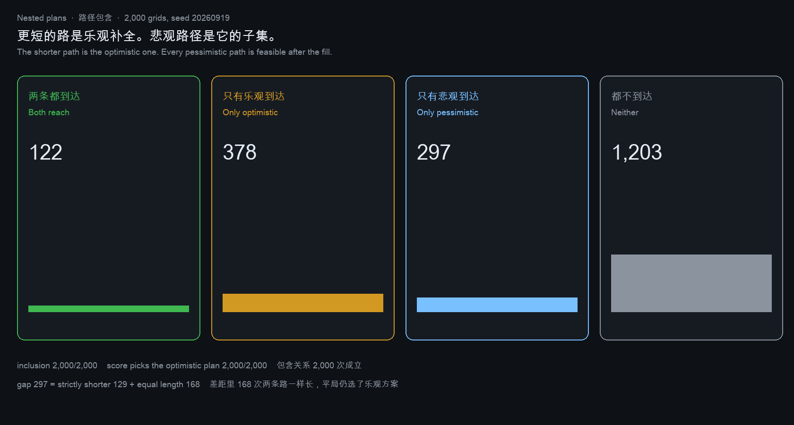

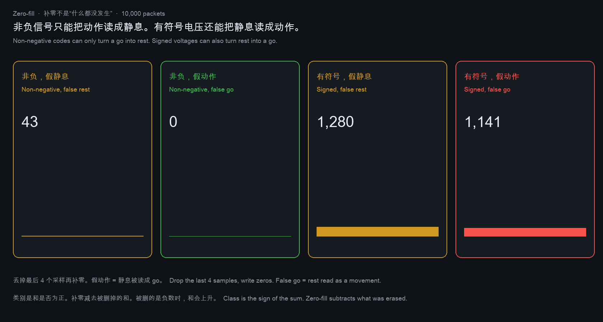

## What the MVP hands over

The delivery is one call with three outcomes. It sits in front of a planner the product already runs.

交付是一次调用、三种结果。它坐在产品已经在跑的规划器前面。

| Call | What it does | What it refuses to do |
|---|---|---|
| `measure` | Uses only entries that were observed. On a tie between a filled path and an observed-free path, it keeps the observed-free path. On a signed EEG window it does not write zeros over a dropout. | It does not invent a value for a hole, and it does not break a tie toward the filled plan. |
| `impute` | The audit twin. Same planner after the hole has been written free, written zero, or replaced by the visible row. | It is not the shipped decision. It exists so a demo can show the disagreement. |
| refuse | The result on empty input. | No zero, no empty list, no NaN. |

What a caller sees on the pinned demo:

| Input | Shipped decision | What a fill would have returned |
|---|---|---|
| Three cells, middle unseen | reach **2** | reach **3**, the fully observed map |
| Eight EEG samples, packet dropped and written as zeros | class **1** on the recorded samples | class **0**, identical to rest |
| Reward table, next action | lookahead action **1** | myopic action **0** |
| Empty input | raises | a usable number, in the libraries above |

Not in this MVP: a trained video model, a headset SDK, a robot success rate, or a claim that 68.9% and 79.2% were re-run. Those percentages belong to Yuan et al. The MVP shows the same kind of gap as an integer a reviewer can recompute.

这次 MVP 里没有：训练好的视频模型、头戴设备 SDK、机器人成功率，也没有“我们重跑了 68.9% 和 79.2%”这种说法。那两个百分比属于 Yuan 等人。MVP 把同一类差距做成一个可以重算的整数。

## The page a person can open

The thing to hand someone is a static page: [`site/index.html`](site/index.html). It runs the three decisions in the browser. The map, the EEG window, and the reward row each show the filled answer next to the measured answer. Nothing on that page is trained.

一个人可以打开的东西是一个静态页面：[`site/index.html`](site/index.html)。三个决策在浏览器里算完。地图、脑电窗口、奖励表，各自把补全后的答案和实测答案摆在一起。这个页面上没有训练。

A team that raises a round to build a video world model is building the generator. This page is the check in front of that generator. The check is a file because every shipped decision is an integer with a proof. The generator is a different program, with data, training, and a robot evaluation that this MVP does not pretend to replace.

拿一轮融资去做视频世界模型的团队，做的是生成器。这个页面是放在生成器前面的检查。检查可以是一个文件，因为交出去的每个决策都是一个有证明的整数。生成器是另一件事，需要数据、训练和机器人评估。这个 MVP 不假装替代那件事。

One question is not that check. On the same 2,000 grids, the filled plan crashes 1,439 times. Blocking the first crash cell, then planning again, lets 614 paths arrive and leaves 786 crashing on a later masked cell. The page shows a five-cell corridor with the same shape: fill crashes, one question crashes again, the measured step never enters the unseen cell.

一次追问不是这个检查。同样的 2,000 张图上，补全方案撞了 1,439 次。封住第一次撞上的格子再规划，614 条路能到，786 条在后面另一个被遮格子上再撞。页面上有一条五格走廊，形状相同：补全会撞，问过一次还会撞，实测步不进入没看见的格子。

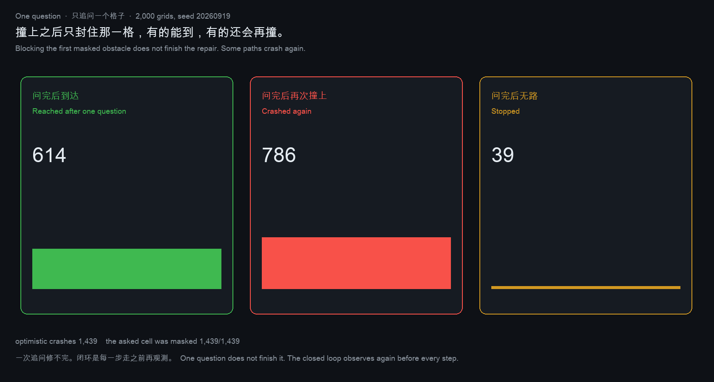

Asking until the path is clear does not stop at one. Of 2,000 grids, 561 need no question, 653 are done in one, and 786 need more than one. The questions total 2,814. One grid needs 9. The 786 is the majority of the grids that crash, not a thin tail.

一直问到路能走通或者无路可走，并不会停在一次。2,000 张图里，561 张不用问，653 张问一次就结束，786 张要问多于一次。追问合计 2,814 次。有一张图要问 9 次。这 786 张是会撞的图里的多数，不是一条细尾巴。

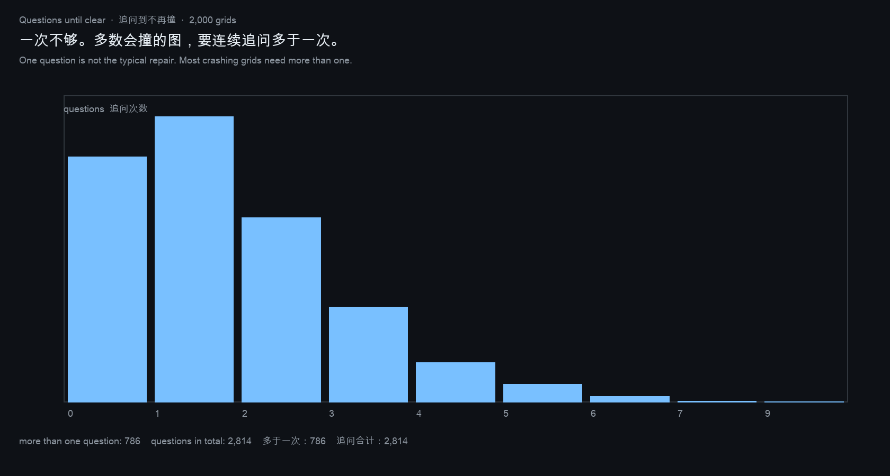

The page deploys as a GitHub Pages site from this repository. It does not ask for an account.

We do not post it on another project's issue tracker. Those issues are for defects in that project. A comment whose real content is a product announcement gets removed, and it should. When one of those libraries has an empty-input defect we can fix with a test, the contribution is a pull request. Traffic for this boundary is the page and this README.

页面用本仓库的 GitHub Pages 发布，不需要账号。

我们不把它发到别的项目的 issue 里。那些 issue 是为了那个项目自己的缺陷。一条实际内容是产品公告的评论会被删掉，也应该被删掉。某个库在空输入上确有缺陷、而且我们能用测试修好时，贡献的形式是一个 pull request。这个边界的流量来自这个页面和这份 README。

```bash
make check
python3.12 show_story.py
python3.12 show_policy.py
```

`make check` recomputes the pinned identities. The proofs and the method-by-method comparison with the papers above are in [`paper/paper.md`](paper/paper.md). Counts live in `results/`. Side-by-side callers need the versions in `requirements-show.txt`.

## Projects this boundary is meant to sit in front of

| Project | URL | Where the boundary attaches |
|---|---|---|
| [V-JEPA 2.1](https://arxiv.org/abs/2603.14482) | masked video tokens | do not treat a predicted patch as a measured cell |
| [Cosmos](https://github.com/nvidia-cosmos/cosmos-predict1) | predicted frames | same, for a rendered future |
| [LaBraM](https://arxiv.org/abs/2405.18765) | masked EEG | do not classify a zero-filled dropout as rest |
| NetworkX | https://github.com/networkx/networkx | one observed step versus the fixed point |
| MNE-Python | https://github.com/mne-tools/mne-python | a recording with no samples raises |
| MuJoCo | https://github.com/google-deepmind/mujoco | an empty model raises |
| Foxglove MCAP | https://github.com/foxglove/mcap | a log with no messages raises |
| ROS 2 rosbag2 | https://github.com/ros2/rosbag2 | a bag with no messages raises |
| ROS map_server | https://wiki.ros.org/map_server | unknown cells stay unknown |
| FilterPy | https://github.com/rlabbe/filterpy | an empty update raises |

The kernels that implement those refusals on the occupied formats are under `locks/`. The index is [`ATLAS.md`](ATLAS.md).

## Files

| Path | What the MVP calls |
|---|---|
| `tick.py` | one observed step |
| `datalog.py` | the fixed point a fill would return |
| `complete.py` · `decode.py` · `policy.py` | the three fills: map, EEG, reward row |
| `partition.py` | nested plans, and the tie rule |
| `signfill.py` | zero-fill on non-negative codes versus signed voltages |
| `decisive.py` | one question after the first crash |
| `askdepth.py` | how many questions until the path is clear |
| `session.py` | hold the sound on a dropped window; do not draw a grasp through an unseen cell |
| `fleet.py` | the same 2,000 maps on one core and on many; the crash count matches |
| `media.py` | empty WAV, empty image, empty cloud, beside a held session |
| `pace.py` | left-right rate: 2 or 6 when the window is complete, unchanged when it is not |
| `room.py` | the picture stops at the last cell the camera saw |
| `attempt.py` | a heard movement does not enter a cell the camera did not see |
| `ledger.py` | a dropped window stores no class; the hand cell was seen |
| `company.py` | a person is drawn only if their cell was seen |
| `framecheck.py` | a second drawing of the held frame matches; the filled frame does not |
| `clock.py` | a dropped window moves neither the rate nor the frame |
| `near.py` | distance to a person on seen ground, and on the filled map |
| `reel.py` | the rate may change while every pixel stays |
| `aperture.py` | a missing joint sample is not a closed finger |
| `site/index.html` | the page that runs the three decisions in the browser |
| `paper/paper.md` | the theory, the way it was found, the comparison with each cited method |
| `tests/test_precision.py` | the identities the MVP is not allowed to move |
| `kits/README.md` | where the local launcher, nature models, and piano recording live |

## Local picture and sound kits

The open-world picture is not a shipped Unreal level. On this machine the Epic Games Launcher is installed, two CC0 nature model packs are unpacked, and a public-domain recording of Beethoven's Piano Sonata No. 15 is on disk. The Unreal Editor binary is not installed: UE 4.27's Mac notes stop at macOS Big Sur, and this computer is Apple Silicon on macOS 26. Signing into the launcher is how an engine build is obtained. The files stay off GitHub. Paths and licenses are in [`kits/README.md`](kits/README.md).

开放世界的画面还不是一个已经发布的虚幻关卡。这台机器上已经装了 Epic 启动器，解压了两套 CC0 自然场景模型，并放了一份贝多芬第 15 钢琴奏鸣曲的公有领域录音。虚幻编辑器本体没有安装：UE 4.27 的 Mac 说明停在 macOS Big Sur，而这台电脑是 Apple Silicon 上的 macOS 26。引擎构建要通过登录启动器取得。这些文件不进 GitHub。路径和许可在 [`kits/README.md`](kits/README.md)。

## License

MIT
