# Worldtick: imputation under partial observability

[](https://github.com/shaneraphel/aletheia-worldtick/actions/workflows/check.yml)

Partially observed input, a fail-closed validator, and the measured cost of filling in the blanks.

部分可观测输入、fail-closed 校验，以及补齐缺失后的实测代价。

## Problem

In 2026, world models, neural decoding models, and action models share one inference step: impute the unobserved part of the input, then decide from the completed picture. [V-JEPA 2.1](https://arxiv.org/abs/2603.14482) predicts masked video patches. [Cosmos](https://github.com/nvidia-cosmos/cosmos-predict1) and VAE decoders reconstruct frames to high pixel fidelity. [LaBraM](https://arxiv.org/abs/2405.18765) predicts masked EEG segments, and missing channels are spatially interpolated ([InterpolatedLaBraM](https://braindecode.org/dev/generated/braindecode.models.InterpolatedLaBraM.html)). World action models render the next observation, then select an action from the rendering.

Two 2026 studies state the open question. Nilaksh et al. ([CVPR 2026 workshop](https://arxiv.org/abs/2605.06388)) show pixel fidelity does not imply planning performance: reconstruction latents win on image metrics while semantic latents win on policy behavior. Zhang et al. ([test-time planning, 2026](https://arxiv.org/abs/2609.24745)) show generating plausible futures is easier than selecting the action those futures support (oracle selection 68.9% → 79.2%; tested selectors recover little).

This repository asks that question in three small, fully reproducible settings — occupancy reachability, EEG classification, and tabular action selection — and answers with one pair of integers. Optimistic imputation returns the larger number, which can equal the fully observed value. A single measured transition returns the smaller number. Empty input is fail-closed (raises; never 0).

2026 年的世界模型、神经解码模型和动作模型，共用同一个推理步骤：补齐输入中没观测到的部分，再基于补全后的图像做决策。V-JEPA 2.1 预测被遮住的视频块。Cosmos 和 VAE 把画面重建到像素级逼真。LaBraM 预测被遮住的脑电，缺失通道做空间插值。世界动作模型先渲染下一步观测，再从渲染结果里选动作。

两篇 2026 年的工作点出了开放问题。Nilaksh 等人（CVPR 2026 workshop）证明像素保真不等于规划性能：重建类隐变量赢图像指标，语义类隐变量赢策略行为。Zhang 等人（2026 测试时规划）证明生成像样的未来，比从这些未来里选出该执行的动作更容易（oracle 选择 68.9% → 79.2%，实测选择器几乎收不回这个差距）。

本仓库在三个小而完全可复现的设定里问同一个问题——占据可达、脑电分类、表格型动作选择，用同一对整数回答。乐观补全给出较大的数，可以和全观测值相同。单步实测转移给出较小的数。空输入 fail-closed（抛异常，永不返回 0）。

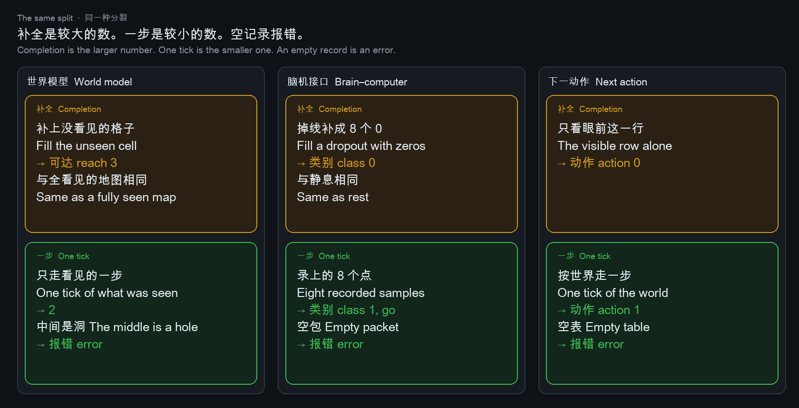

| Setting | Optimistic imputation | One measured step | Empty input |
|---|---|---|---|
| World model, 3 cells, middle masked | reach **3**, equals the fully observed map | reach **2** | raises |
| EEG, 8 samples | dropout zero-filled → class **0**, equals rest | recorded samples → class **1** (go) | raises |
| Reward table, next action | myopic row → action **0** | one-step lookahead → action **1** | raises |

| 设定 | 乐观补全 | 单步实测 | 空输入 |
|---|---|---|---|
| 世界模型，3 格，中间被遮 | 可达 **3**，等于全观测地图 | 可达 **2** | 抛异常 |
| 脑电，8 采样 | 丢失补零 → 类别 **0**，等于静息 | 实录采样 → 类别 **1**（go） | 抛异常 |
| 奖励表，下一步动作 | 只看当前行 → 动作 **0** | 前视一步 → 动作 **1** | 抛异常 |

On the pinned large map the same pair is one step **24** versus fixed point **214**. On the pinned 256×8 reward table the myopic row is action **2** and one-step lookahead is action **5**.

大地图上同一对数是单步 **24**、不动点 **214**。256×8 奖励表上，当前行动作 **2**，前视一步动作 **5**。

## Controlled comparison, 10,000 trials

Seed `20260919`. Chains of 8 cells. Imputation writes masked cells as free. The measured step starts only from observed cells.

种子 `20260919`。8 格链。补全把被遮格写成空闲。实测步只从已观测格出发。


| | Imputation | Measured step | Rate |
|---|---|---|---|
| World model | reach **8**, equals the completed map | **2** | **10,000 / 10,000** |
| EEG | zero-filled dropout → class **0**, equals rest | recorded → class **1** | **10,000 / 10,000** |
| Next action | myopic row → action **0** | lookahead → action **1** | **10,000 / 10,000** |

Counts are in `results/CAMPAIGN.json`. `python3.12 campaign.py` recomputes them.

| 2026 work | Their imputation step | Result here |
|---|---|---|
| [V-JEPA 2.1](https://arxiv.org/abs/2603.14482) | masked video patches are predicted | imputed cells reach 8; the measured step is 2 |
| [Reconstruction or Semantics?](https://arxiv.org/abs/2605.06388) | Cosmos / VAE complete frames; pixels match, plans may not | imputed reach equals the fully observed map |
| [LaBraM](https://arxiv.org/abs/2405.18765) + [InterpolatedLaBraM](https://braindecode.org/dev/generated/braindecode.models.InterpolatedLaBraM.html) | masked EEG predicted; missing channels interpolated | zero-filled class equals rest, both 0 |
| [Beyond Visual Quality](https://arxiv.org/abs/2609.24745) | render futures first, then select an action | myopic vs lookahead actions differ in 10,000 / 10,000 |

## Closed-loop cost of optimistic imputation

True corridors with obstacles. The sensor masks 30% of cells. Optimistic imputation writes each masked cell as free and walks. The measured step stops at the first masked cell. 32 cells, 10,000 corridors, seed `20260919`.

真实走廊带障碍。传感器遮掉 30% 格子。乐观补全把被遮格写成空闲再走。实测步停在第一个被遮格。32 格，10,000 条走廊，种子 `20260919`。

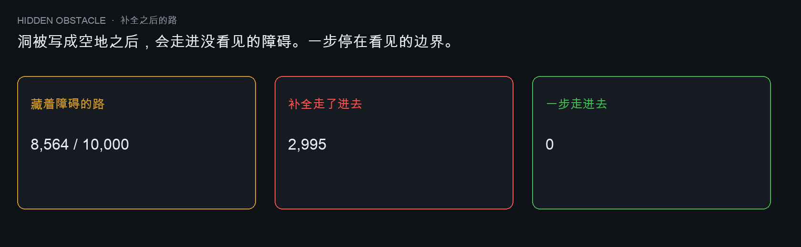

| | Result |
|---|---|
| Corridors with an occluded obstacle | **8,564 / 10,000** |
| Imputation enters it | **2,995** |
| Measured step enters it | **0** |

Counts are in `results/HIDDEN.json`. `python3.12 hidden.py` recomputes them.

## One decision

Same corridors, next cell only. Ground truth goes iff the true next cell is free. Imputation goes iff the filled cell is free. The measured step goes iff the cell was observed free.

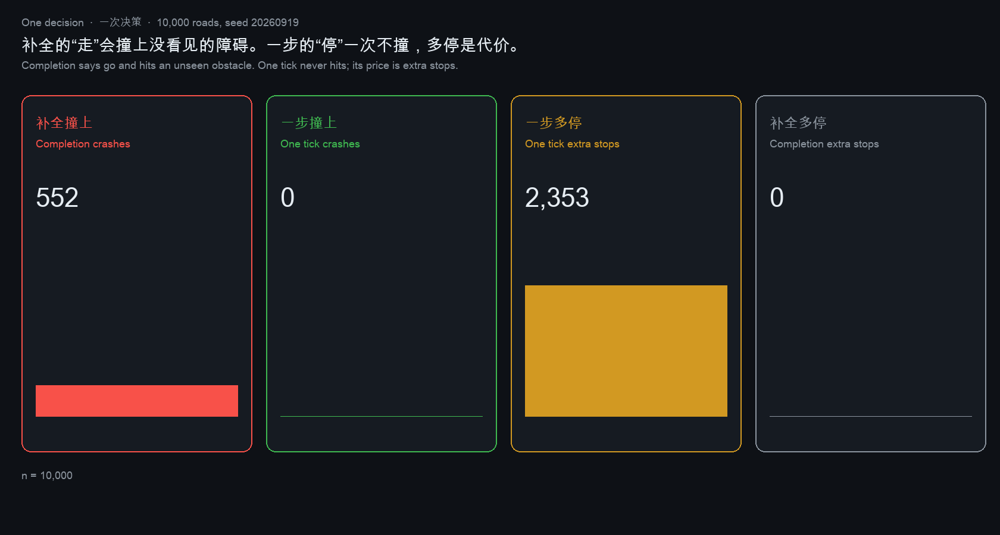

| | Collisions | Conservative stops on free road |
|---|---|---|
| Imputation | **552** | **0** |
| Measured step | **0** | **2,353** |

Counts are in `results/DECIDE.json`. `python3.12 decide.py` recomputes them.

## Optimistic vs pessimistic fill

The same 10,000 corridors. Optimistic: masked cells are free. Pessimistic: masked cells are walls. The fill policy, not the planner, determines the collision count.

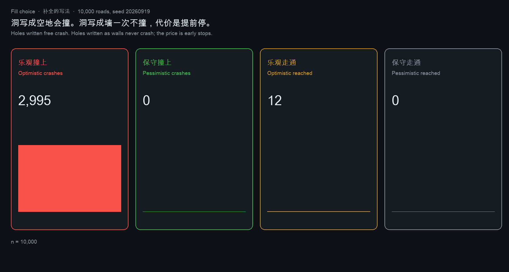

| | Collisions | Stops | Reached the end |
|---|---|---|---|
| Optimistic | **2,995** | **6,993** | **12** |
| Pessimistic | **0** | **10,000** | **0** |

Counts are in `results/FILLCHOICE.json`. `python3.12 fillchoice.py` recomputes them.

## Dropout sweep

10,000 corridors of 32 cells per point. Obstacle rate fixed at 0.20. Mask rate from 0.00 to 0.50.

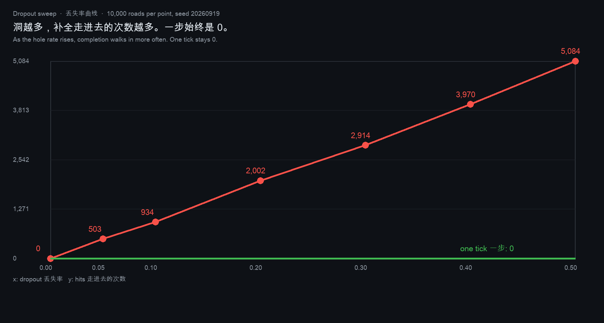

| Mask rate | Imputation enters | Measured step enters |
|---|---|---|
| 0.00 | **0** | **0** |
| 0.05 | **503** | **0** |
| 0.10 | **934** | **0** |
| 0.20 | **2,002** | **0** |
| 0.30 | **2,914** | **0** |
| 0.40 | **3,970** | **0** |
| 0.50 | **5,084** | **0** |

Counts are in `results/SWEEP.json`. `python3.12 sweep.py` recomputes 70,000 corridors.

## Horizon to the fixed point

The pinned 256-node world (256 nodes, 8 observed, 512 edges, seed `20260919`). Horizon from 0 to 256. Imputation answers 214 in one call.

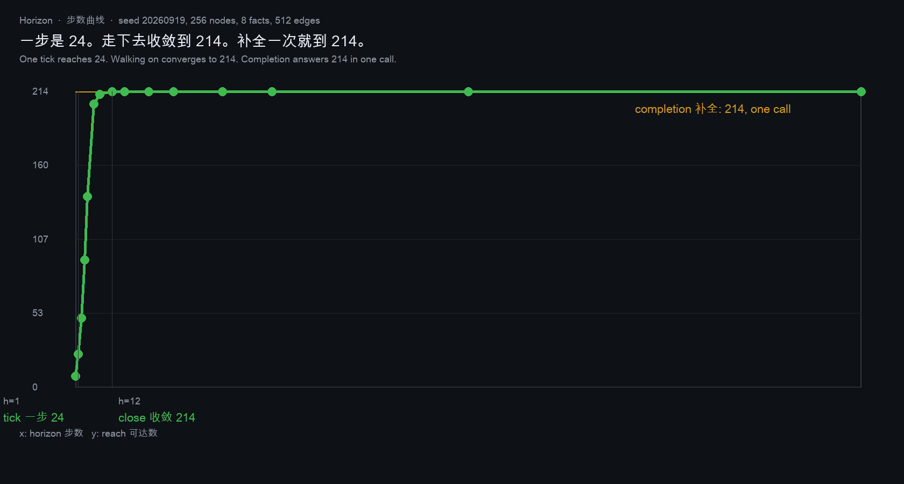

| Horizon | 0 | 1 | 2 | 3 | 4 | 6 | 8 | 12 |
|---|---|---|---|---|---|---|---|---|
| Reach | **8** | **24** | **50** | **92** | **138** | **205** | **212** | **214** |

Converges at 12 steps, flat afterwards. Counts are in `results/HORIZON.json`. `python3.12 horizon.py` recomputes them.

## Price of the walk

Median milliseconds per call on this machine (7 timed trials × 50 repeats; timings reported, reach pinned). Cost grows with the horizon and flattens exactly where reach flattens.

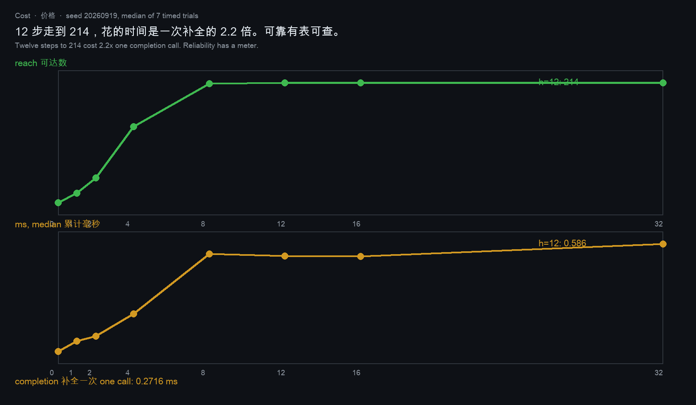

| Horizon | 0 | 1 | 2 | 4 | 8 | 12 | 32 |
|---|---|---|---|---|---|---|---|
| Reach | **8** | **24** | **50** | **138** | **212** | **214** | **214** |

One completion call answers 214 in ~0.09 ms here; the 12-step walk costs a small multiple of that. Numbers are in `results/COST.json`. `python3.12 cost.py` recomputes them.

## Robustness across seeds

Dropout 0.30, 2,000 corridors per seed, five seeds. Completion-side counts move with the seed. Tick-side columns are 0 on all five seeds.

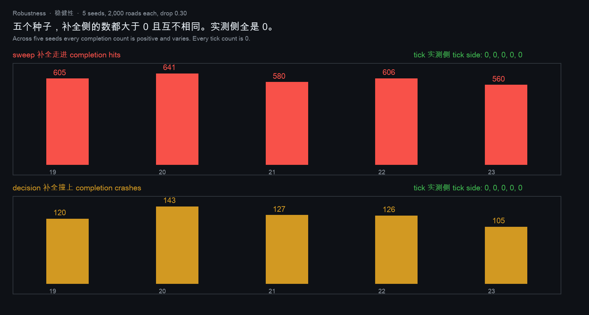

| Seed | Sweep completion hits | Sweep tick hits | Decision crashes | Decision tick crashes |
|---|---|---|---|---|
| 20260919 | **605** | **0** | **120** | **0** |
| 20260920 | **641** | **0** | **143** | **0** |
| 20260921 | **580** | **0** | **127** | **0** |
| 20260922 | **606** | **0** | **126** | **0** |
| 20260923 | **560** | **0** | **105** | **0** |

Counts are in `results/ROBUST.json`. `python3.12 robust.py` recomputes 20,000 corridors.

## Foresight threshold, with proof

Trap table `[[10,1],[-100,-100]]`: action 0 pays 9 more now but steps into −100. Past discount **9/101**, the optimal action flips from **0** to **1**. Proof: under "always action 0", V₀ = (10−100d)/(1−d²); Q₀(a₁) = 1+dV₀ > V₀ ⟺ 1+d > 10−100d ⟺ 101d > 9. Policy evaluation solves (I−dP)V = r in exact rationals, so the threshold is sharp.

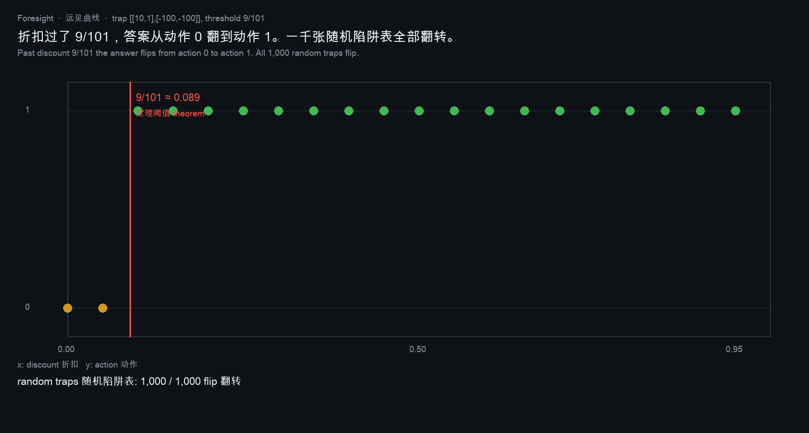

| Discount | 0.00–0.08 | 0.09–0.95 | 1,000 random traps, d=0 vs 0.9 |
|---|---|---|---|
| Action | **0** | **1** | **1,000** flip |

Counts are in `results/FORESIGHT.json`. `python3.12 foresight.py` recomputes them.

## EEG dose–response

Ten thousand random go packets of 8 samples. Drop the last k samples, zero-fill. Packets classified as rest:

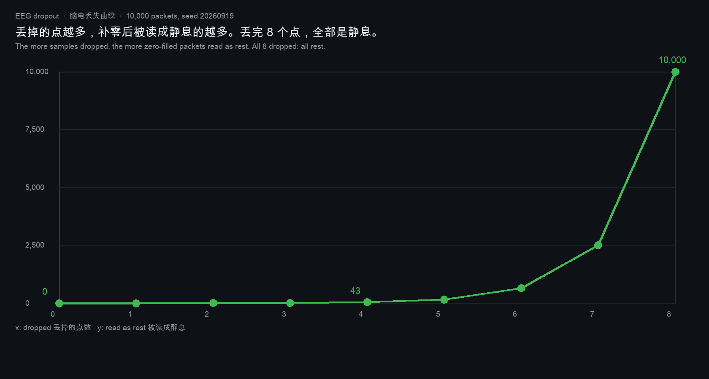

| Dropped | 0 | 4 | 7 | 8 |
|---|---|---|---|---|
| Read as rest | **0** | **43** | **2,494** | **10,000** |

Counts are in `results/BCISWEEP.json`. `python3.12 bcisweep.py` recomputes them.

## Audit: imputation deletes the mask

On the same 10,000 corridors: imputed maps carry zero mask markers by construction, so a downstream checker that looks for missing-data markers catches none of the 8,564 wrong maps. Only **1,436** imputed maps match the true corridor cell for cell.

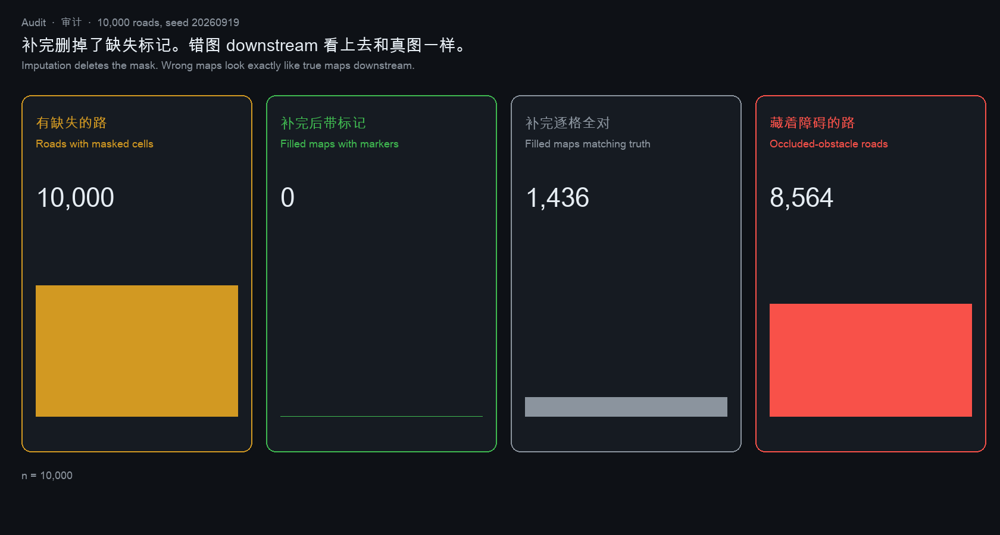

| | Count |
|---|---|
| Roads with masked cells | **10,000** |
| Filled maps still carrying a marker | **0** |
| Filled maps matching the true road | **1,436** |
| Roads with an occluded obstacle | **8,564** |

Counts are in `results/AUDIT.json`. `python3.12 audit.py` recomputes them.

## Upstream side-by-side behavior

Each row calls the upstream project and this repository on the same input. Empty input is fail-closed here.

| Project | Upstream result | This repository |
|---|---|---|
| [MuJoCo 3.13.0](https://github.com/google-deepmind/mujoco), empty model | loads successfully | refuses a cost-free MJCF |
| [munkres 1.1.4](https://github.com/bmc/munkres), empty table `compute([[]])` | returns `[]` ([issue 54](https://github.com/bmc/munkres/issues/54)) | raises; the 2×2 assignment stays cost **2** |
| [NumPy 2.4.6](https://github.com/numpy/numpy), empty vector norm | `0.0` | raises; `CAKE` stays distance **3** |
| [MNE-Python 1.9.0](https://github.com/mne-tools/mne-python), empty recording | duration 0, 0 annotations | raises; the recorded clip stays **8** samples, markers `go` / `end` |
| [NumPy 2.4.6](https://github.com/numpy/numpy), empty mean | `nan` | raises |
| [NetworkX 3.6.1](https://github.com/networkx/networkx), empty graph | 0 nodes | raises while edges remain; 1 step reaches **2**, fixed point **3** |
| [FilterPy 1.4.5](https://github.com/rlabbe/filterpy), empty update | accepted, state stays `0.0` | raises; 2 lidar points count **1**, 3 observations count **3** |
| [Foxglove MCAP](https://github.com/foxglove/mcap), zero messages | empty log | raises |
| [ROS 2 rosbag2](https://github.com/ros2/rosbag2), zero messages | empty bag | raises |
| [pybloom-live 4.0.0](https://github.com/joseph-fox/python-bloomfilter), keyless filter | reports non-membership | raises on an empty key list |


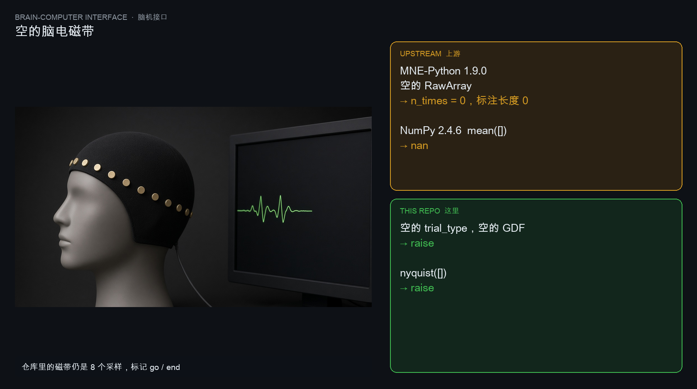
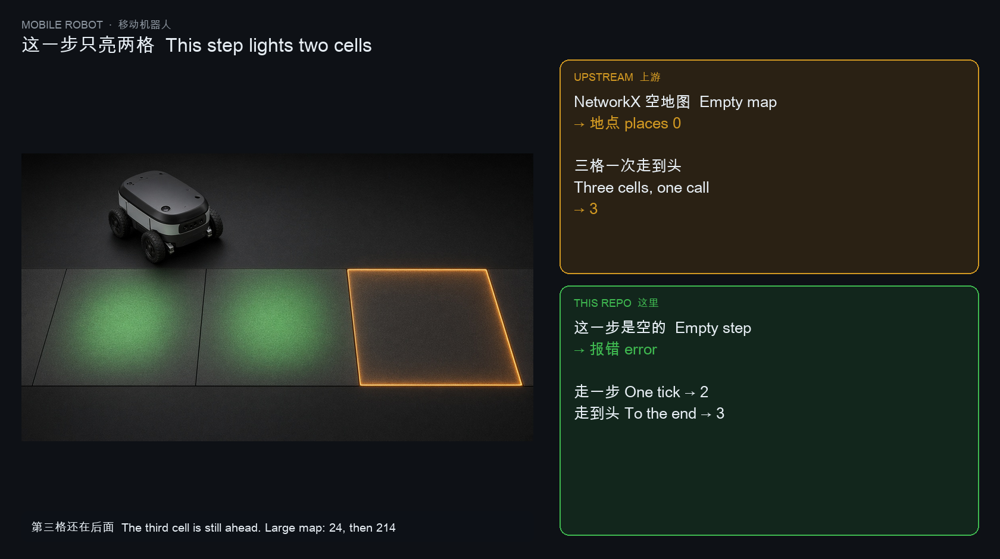
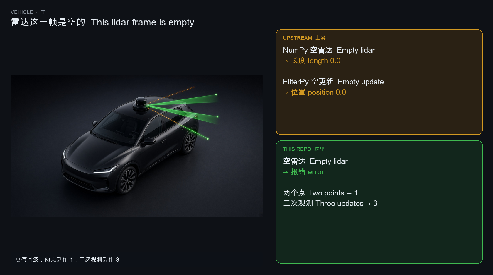

Kernels: [`locks/aletheia-handlock`](locks/aletheia-handlock) · [`locks/aletheia-fingerlock`](locks/aletheia-fingerlock) · [`locks/aletheia-spikelock`](locks/aletheia-spikelock) · [`locks/aletheia-bloomlock`](locks/aletheia-bloomlock) · [`locks/aletheia-voxelock`](locks/aletheia-voxelock) · [`locks/aletheia-kalmanlock`](locks/aletheia-kalmanlock) · [`locks/aletheia-tourlock`](locks/aletheia-tourlock)

## Reproduce

The precision check uses the Python standard library only. Side-by-side callers need the versions pinned in `requirements-show.txt`.

```bash
make check
python3.12 show_tick.py
python3.12 show_policy.py
python3.12 show_networkx.py
```

Counts live in `results/`. `make check` recomputes every pinned number. Every push recomputes them in CI.

## Upstream projects

| Project | URL | Role in this repo |
|---|---|---|
| NetworkX | https://github.com/networkx/networkx | graph baseline in `show_networkx.py` |
| Foxglove MCAP | https://github.com/foxglove/mcap | occupancy samples in `mcapocc.py` |
| ROS 2 rosbag2 | https://github.com/ros2/rosbag2 | bag folders in `bagocc.py` |
| rosbags | https://gitlab.com/ternaris/rosbags | reader in `show_rosbags.py` |
| ROS map_server | https://wiki.ros.org/map_server | YAML + PGM occupancy maps |
| OccupancyGrid | https://docs.ros.org/en/humble/p/nav_msgs/interfaces/msg/OccupancyGrid.html | cell values in `occgrid.py` |
| ROS 2 | https://github.com/ros2/ros2 | stack those bags and maps come from |
| Soufflé | https://github.com/souffle-lang/souffle | Datalog fixed-point reference; closure here is 214 |
| NumPy | https://github.com/numpy/numpy | side-by-side calls in `locks/` |
| MNE-Python | https://github.com/mne-tools/mne-python | EDF / GDF / BIDS-EEG traces |
| BIDS | https://github.com/bids-standard/bids-specification | BIDS-EEG sidecars |
| NiBabel | https://github.com/nipy/nibabel | NIfTI volumes in [`ATLAS.md`](ATLAS.md) |
| OpenDRIVE | https://github.com/asam-oss/asamOpenDRIVE | junction maps in the lock kernels |
| MuJoCo | https://github.com/google-deepmind/mujoco | MJCF bodies in the lock kernels |
| Open3D | https://github.com/isl-org/Open3D | point clouds in the lock kernels |
| nuScenes | https://github.com/nutonomy/nuscenes-devkit | sample tables in the lock kernels |
| pyahocorasick | https://github.com/WojciechMula/pyahocorasick | suffix-link comparison in stemlock |
| python-bloomfilter | https://github.com/joseph-fox/python-bloomfilter | membership comparison in bloomlock |

## Files

| Path | Contents |
|---|---|
| `tick.py` | single-step transition: 2, and 24 |
| `datalog.py` | fixed-point reachable set: 3, and 214 |
| `policy.py` | integer policy iteration; empty table raises |
| `complete.py` · `decode.py` | imputation operators for maps and EEG |
| `campaign.py` · `hidden.py` · `sweep.py` | 10k–70k corridor experiments |
| `horizon.py` · `foresight.py` | convergence curve; 9/101 threshold with proof |
| `bcisweep.py` · `decide.py` · `fillchoice.py` · `audit.py` | dose–response; decision costs; fill policy; mask audit |
| `occgrid.py` · `mcapocc.py` · `bagocc.py` | ROS grid, MCAP, rosbag2 readers |
| `tests/test_precision.py` | 8 pinned identities |
| `results/` | pinned JSON from every run |
| `locks/` | 66 format kernels |
| `binds/` | 100 named-record binds |
| [`ATLAS.md`](ATLAS.md) | index of the above |

## License

MIT
