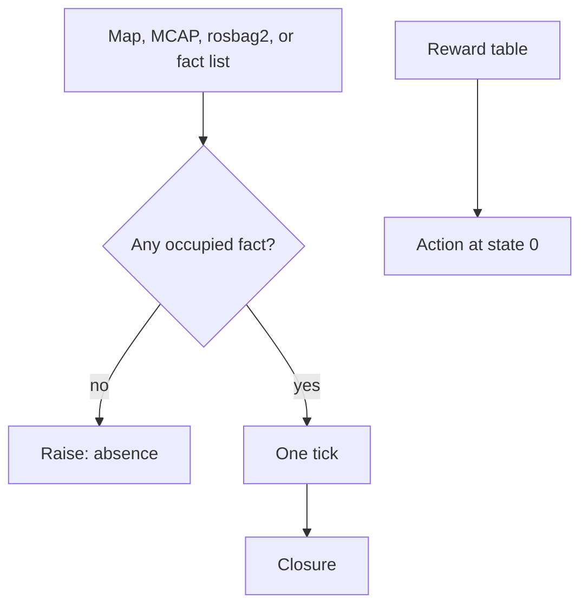

# Worldtick

Fact reachability for one discrete tick of a world. An empty fact tape is absence.

Autonomy software reads the world from a map, a bag, or a graph. When that tape is empty — a dropout, a blank grid, a log with no messages — a reader that returns zero tells the downstream planner the world is clear. Worldtick raises.

The kernels on this path are exact integer programs. Trained parameters: 0. Gradient steps: 0.

[](https://github.com/shaneraphel/aletheia-worldtick/actions/workflows/check.yml)

## Highlights

1. **Absence raises.** An empty fact list, a negative world width, a blank occupancy grid, an MCAP log with zero messages, and a rosbag2 folder with zero messages all raise. They do not become a reachable count of zero, and an empty reward table does not become action 0.

2. **One tick is a different number from the closure.** On the checked-in 1×3 occupancy map, one tick reaches **2** cells and the closure reaches **3**. On the pinned 256-node world (seed `20260919`, 8 facts, 512 edges), one tick reaches **24** nodes and the closure reaches **214**. Walking 256 ticks meets the closure.

3. **The planned action can disagree with the greedy row.** On a 2-state reward table, the current row picks action **0** and policy iteration picks action **1**. On the pinned 256×8 table, the greedy row picks **2** and iteration picks **5**, on two walks.

4. **The same rule on logs stacks already write.** ROS `map_server` YAML + PGM, Foxglove MCAP, ROS 2 rosbag2 (sqlite3), and a live NetworkX 3.6.1 run on the same 3-node world. NetworkX reports an empty node set. This kernel raises while the edges are still there.

5. **A reviewer can break the claim.** `make check` recomputes the identities. GitHub Actions runs that check on every push. The counts below are copied from `results/`.

6. **The format index is already in the repo.** 66 lock kernels and 100 binds cover tapes those stacks write — occupancy, MCAP, NIfTI, BIDS-EEG, OpenDRIVE, and the rest. The index is [`ATLAS.md`](ATLAS.md).



## Run

```bash
make check
python3.12 show_tick.py
python3.12 show_policy.py
python3.12 show_networkx.py
python3.12 tick_bench.py
python3.12 datalog_bench.py
python3.12 policy_bench.py
```

Show dependencies (NetworkX, MCAP, rosbags) are pinned in `requirements-show.txt`. The precision check uses the standard library only.

## Pinned replay

Copied from `results/TICK_EVIDENCE.json` and `results/DATALOG_EVIDENCE.json`.

| field | value |
|---|---|
| python | CPython 3.12.8 |
| platform | macOS-26.2-arm64 |
| seed | 20260919 |
| world | 256 nodes, 8 facts, 512 edges |
| one tick | 24 |
| closure, twice | 214 |
| closure after 256 ticks | 214 |

Copied from `results/POLICY_EVIDENCE.json` and `results/SHOW_POLICY.json`.

| field | value |
|---|---|
| 2-state table, greedy / iterated | 0 / 1 |
| 256 states × 8 actions, greedy | 2 |
| 256 states × 8 actions, iterated, twice | 5 |
| `policy_iteration` median | 0.00597583397757262 s |
| row-0 greedy median | 9.832961950451136e-06 s |

Datalog closure on the same world matches a BFS reach count of 214. Median times from `results/DATALOG_EVIDENCE.json`: fixpoint 0.0003089579986408353 s, BFS 0.0001294169924221933 s.

## What is in the box

| path | role |
|---|---|
| `tick.py` | one tick, and reachability after a horizon |
| `datalog.py` | closure of the same facts |
| `policy.py` | integer policy iteration; empty table raises |
| `occgrid.py` | ROS occupancy YAML + PGM, then a 4-connected graph |
| `mcapocc.py` | Foxglove MCAP occupancy samples |
| `bagocc.py` | ROS 2 rosbag2 folder |
| `tests/test_precision.py` | the identities above |
| `results/` | pinned JSON from the runs |
| `locks/` | 66 format kernels |
| `binds/` | 100 binds |
| `ATLAS.md` | the index |

## License

MIT

## Atlas

66 lock kernels, 100 binds, 10 resource lists, and 6 tools live under `locks/`, `binds/`, `docs-awesome/`, and `tools/`. The index is [`ATLAS.md`](ATLAS.md).
