# Worldtick

[](https://github.com/shaneraphel/aletheia-worldtick/actions/workflows/check.yml)

这是一层放在世界模型前面的检查，不是另一个世界模型。

非侵入脑电要告诉游戏“人有没有在动”。手上的摄像机和关节角度要告诉游戏“手现在在哪、手指弯成什么样”。世界模型负责把这些画成实时的三维画面。现在常见的做法是：哪一路还没到，就先补一幅完整的画面，再按这幅画面行动。补完以后，下一家程序看不出哪一块是猜的。

我们不替换画未来的那个模型。同一套找路的程序跑两遍。一遍用补完的场景，一遍只用传感器真正送来的部分。交给用户的是第二遍。第一遍留在旁边，让人看见两遍不一样。什么都没送来的时候，这次调用停住，不交回一个看起来像测量结果的零。

A check in front of a world model, not another world model.

A non-invasive brain recording is supposed to tell the game whether the person moved. A camera on the hand, and the joint angles, are supposed to tell the game where the hand is and how the fingers are bent. The world model turns that into a real-time 3D picture. The usual next step completes whatever has not arrived yet, then acts on the completed picture. After that completion, the next program cannot see which part was guessed.

We do not replace the model that draws the future. The same path-finding routine runs twice: once on the completed scene, once on only what the sensors actually sent. The user receives the second. The first stays beside it, so the disagreement is visible. When nothing was sent, the call stops, and it does not hand back a zero that looks like a measurement.

可以打开的页面：[shaneraphel.github.io/aletheia-worldtick](https://shaneraphel.github.io/aletheia-worldtick/)。证明、和每篇论文的对照、全部次数，在 [`paper/paper.md`](paper/paper.md)。

## 怎么读

1. 先打开页面，按按钮。看走廊上的三种走法，一段脑电，奖励表上的下一步，左耳和右耳交替的声音，一根手指，脑电和手指有一边还没到的时候画面留在哪，两家住户各留各的画面，画面有几步没更新了，谁蒙对了，断完第几步追上，两路不一样快时画面有几步是全新的，一间房里两只手各动各的，以及越晚、全新的越少，最坏能坏到哪，记下来再算一遍，三路都到才是全新的，以及同一批两种芯片数出来一样。
2. 再读下面三节：这幅画面给谁；别人的方法和我们的方法差在哪；今晚交出去的是什么。
3. 要核对一个数，或要看证明，打开笔记。这份说明不把实验次数再念一遍。

1. Open the page and press the buttons first. Walk the corridor three ways, look at a brain recording, pick the next action, listen to clicks that alternate between the ears, look at one finger, see what the picture does when the brain recording or the finger is late, see two tenants keep separate pictures, see how many steps old the picture is, see who is right by luck, see how many steps a catch-up takes after a burst, see how many frames are new when the streams run at different speeds, see two hands in one room move independently, see new frames fall as arrivals get later, see how bad a miss budget can get, see the record replay itself, see three streams make one new frame, and see one batch counted the same on two chips.
2. Then read who the picture is for, how this method differs from the others, and what is actually handed over.
3. The note has the proofs and the counts. This file does not recite them.

## 这幅画面给谁

两个人会用同一幅画面。这里没有从人身上采数据，也不声称在治疗谁。

Two people would use the same picture. Nothing here was collected from a person, and nothing here claims to treat anyone.

**正在适应一只灵巧手的人。** 画面要在动作还没做完的时候，让他看见这一下，用来练。摄像机没拍到的地面，不能画成已经走过去。关节角度还没传来的手指，不能画成已经握紧。他要是按一幅场景里没有的动作去练，练的就不是这只手。房间里可以有别人。他们站着。画面不把人派过去找他们，也不把摄像机没看见的人画进来。

**Someone learning a dexterous hand.** The picture shows the motion before it is finished, so he can practice. Ground the camera did not see is not drawn as already crossed. A finger whose angle has not arrived is not drawn as already closed. Practicing a motion the place does not contain is not practice with this hand. Other people may stand in the room. The picture does not send him to them, and it does not draw people the camera never saw.

**想把一段左右交替的声音听下去的人。** 这种声音本身难留，所以游戏是一个可以待着的开阔地方：声音继续，别人在场，不布置任务，也不要求高消耗的来往。若要因为脑电看起来紧张就改音乐、改画面，这一小段必须是传全的。没传全，音乐和画面先不动。把没传到的采样写成零再去改，改的就不是这个人当时的状态。这里不判断惊恐，也不把改速度说成在帮人克服恐惧。

**Someone trying to stay with a sound that alternates left and right.** That sound is hard to keep listening to, so the game is an open place where it can continue, with other people present, without a task and without demanding social effort. If the music or the picture is to change because the brain recording looks tense, that stretch has to have arrived whole. If it has not, the music and the picture stay. Writing zeros into the missing samples and then changing the scene is not a reading of that person. Nothing here detects fright, and changing the speed is not described as helping someone through fear.

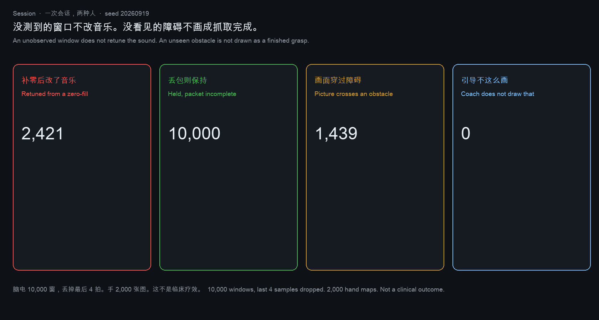

## 别人怎么做，我们怎么做

差别不在“我们也训练一个更大的世界模型”。差别在交出去的那一步用的是哪一幅画面。

The difference is not that we train a larger world model. The difference is which picture the shipped step uses.

| 别人怎么做 | 我们怎么做 | 为什么这就是差别 |
|---|---|---|
| 世界模型先把下一帧画完，再按那一帧行动。[V-JEPA 2.1](https://arxiv.org/abs/2603.14482) 和 [Cosmos](https://github.com/nvidia-cosmos/cosmos-predict1) 交出去的画面上看不出哪一块是猜的。[Nilaksh 等人](https://arxiv.org/abs/2605.06388) 看到：画面更好的模型，拿去规划可以更差。[Yuan 等人](https://arxiv.org/abs/2609.24745) 看到：已经知道每个想象结果的对照，能把成功率从 68.9% 抬到 79.2%；只给画面打分，收不回这个差距。[Zhang 等人](https://arxiv.org/abs/2609.02159) 看到：留下哪一个未来，下一步动作就变了。 | 不另训练一个生成器。同一套找路程序跑两遍。一遍用画完的场景，一遍只用传感器真正送来的部分。交给用户的是第二遍。第一遍放在旁边。 | 只走已经看见的地面，不会比画完之后的那条路更长。所以“选更短的，一样长就选画完的那条”，每次都会选中画完的那条。画面更顺，不代表这一步是测到的。要改的是这条规则，不是再加一个画面分数。Yuan 已经说明画面分数收不回那个差距。68.9% 和 79.2% 是他们的数，这里没有重跑。 |
| [LaBraM](https://arxiv.org/abs/2405.18765) 把没传到的脑电补出来再分类。[InterpolatedLaBraM](https://braindecode.org/dev/generated/braindecode.models.InterpolatedLaBraM.html) 让训练好的模型始终看到训练时的电极布局。包没到、写成零，会和“人没动”得到同一个类别。电压有正有负时，删掉一段负数再写成零，还可以把“没动”读成“动了”。 | 这一小段没传全，音乐和画面先不动。不根据写上去的零去改速度。 | “写成零比较安全”并不成立。错的方向跟着被删掉的那段的正负走。不改速度，就不是一次惊恐判断。 |
| 游戏每一帧都要显示。脑电晚了，就先当成没动。手指角度晚了，就先画成已经握紧。关节的内存如果一开始是零，第一个角度到来之前，手已经是握紧的。 | 这一帧先留着上一次真正到过的声音和角度。两边都到了，两种画法是同一幅。有一边没到，而且默认值和画面上现有的不一样，两幅画才分开。一个核和十个核得到同一个结果。 | 实时并不是必须先猜。晚到的那一路可以等，画面先重复上一次到齐的样子。笔记里的定理 13 写的是这件事。 |
| 下面这张表里的库，在什么都没录上时，仍交回一个下一层程序愿意接着用的结果。 | 同样的情况下停住。有内容的输入，数值和原来一样。 | 调用成功，不等于人是平静的，也不等于手已经握完。 |
| 脑电晚了，手指的角度晚了，画面用缺省值顶上，看起来和刚到的一样新。 | 画面留着上一次到过的，并记下是几步之前传到的。中间三步都没到，年龄涨三步，画面不动。 | 缺省值永远说自己是刚到的。留下的那一版知道自己有几步没更新了。笔记里的定理 15 写的是这件事。 |
| 缺省值蒙对了，就当测到了，继续往下传。 | 蒙对也记成蒙对。手指晚了，留着上一次到过的角度，不说握紧。 | 只晚脑电时，两边蒙对差不多。只晚手指时，留下的蒙对六倍多，因为张开常见，握紧少见。但蒙对几回不是重点，重点是从不把蒙说成测到。笔记里的定理 16 写的是这件事。 |
| 断完之后，缺省值顶上，看起来像追上了。 | 数第几步追上。两边都到的第一步，画面和真实对上，差一步都不算追上。 | 一半左右第一步就追上，也有八十多段七步还没追上。追上之前，留下的对得多，猜对得少。笔记里的定理 17 写的是这件事。 |
| 两路不一样快，也按每步都是新的画。 | 手指三步来一次，画面只在到过的那步更新，年龄照数。 | 十六步里最多六步是全新的。手指的年龄是固定的锯齿，和脑电到没到没关系。笔记里的定理 18 写的是这件事。 |
| 一间房里两只手，一只没信号，整幅画面停住，或者整幅都猜。 | 谁没到，只冻谁的手，另一只照动。先算谁后算谁，两只手看到的一样。 | 一只全黑时，另一只照动上万步。顺序换过来，两只手一步都没变。笔记里的定理 19 写的是这件事。 |
| 晚多晚少，画面看起来一样新。 | 越晚，全新的越少。一滴不晚时，猜和留一次都不分开。 | 从不晚到晚一半，全新的越晚越少，不一样的越晚越多。笔记里的定理 20 写的是这件事。 |
| 晚几步排在哪都一样，反正画面都一样新。 | 预算晚几步，排在最后，画面最老。十六步里晚八步，最老八步。 | 不管怎么排，画面老不过预算。排在最后就顶到预算。笔记里的定理 21 写的是这件事。 |
| 交出去的画面，事后算不回来，对不上账。 | 每一步留一行记录，专从记录重算。两套算法各算一遍，步步一样。 | 十六万步重算，对不上零步。一万段全对。笔记里的定理 22 写的是这件事。 |
| 路越加越多，画面还每步都是新的。 | 三路都到，画面才是全新的。再加一路，全新的再打七折。 | 两路时全新占一半，三路时只剩三分之一。笔记里的定理 23 写的是这件事。 |
| 开放世界里，人没传来，画面也把他画到你身边，看起来你们已经在一起。手每步都走，还会从他身边走过去，把本来站在一起的两个人拉开。 | 在不在一起，只看两边最后一次真正传到的位置。隔两步以内才算站在一起。人没传来，他留在原地。你自己走过去，算你走过去。 | 每步都走的那只手，说你们在一起的次数更少，因为它已经走过他了。留下的画面还有六万五千多步说在一起，猜的画面并没有。猜的画面另有两万七千多步说在一起，位置其实还没到。 |
| 对方屏幕上的你，用每步都在走的那只手来画。他看着你从身边走过，最后站进树桩。 | 他看见的位置，只在这一步真正送到的时候才更新，更新成传感器已经走到的地方，不会更远。 | 每步都走的手，有五万步说自己在他旁边。那是每一段里固定的五步。真正送到的位置说在旁边的少得多。两个位置对不上的有十五万多步。送到的位置一次都没有跑在传感器前面。 |
| 世界模型每一拍都要一张新画面。包到了，就算新的。 | 位置没变，就还是这一张。包到了、人还在原地，不叫模型再画。 | 同一批送到的位置里，九万五千多步位置没变。六万四千多步才换了地方。四万七千多步是包到了、画面却还是原处。 |
| 开放世界里两人之间只有一个距离，画在同一张画面上。 | 你量的是你真正走到的地方离他多远。他量的是最后一次送到的地方离他多远。 | 同一万段里，这两个距离有两万七千多步不一样。绝大多数是你比他所以为的更近。只有几百步是他以为你更近，因为你已经走过他，送到的位置还在近的一侧。 |
| 世界模型把晚到的几步补成一段连续的走路。 | 人一次只走一步。包晚了再送到，画面直接跳到新的位置，中间不补。 | 一万多次是跳过去的，被跳过的位置有一万两千多步。人自己从来没有一次走两步。最远的一跳是八步。 |
| 手合上了，就画在画面上现在的那只手上，不管那只手已经走到哪。 | 这一下合在你当时站的地方。对方的画面如果还停在旧位置，不能把这一下画在那里。每步都走的那只手，更不能当成已经握住树桩。 | 合上的一万四千多次里，三千多次对方还停在旧位置。每步都走的那只手有九百多次被画成握住树桩，你真正站的地方一次都没有。 |
| 最新的握法一到，对方的画面马上换。 | 他看见的握法，是上次送到的那一下。这一步没送到，他的画面不换。你已经张开，他还可以看着合上。 | 两种握法不一样的有七千多次。你合上他还看着张开的有四千多次。你张开他还看着合上的有三千多次。送到的那一步，两种握法一定一样。 |
| 跳过的几步，用最后的握法涂成一段连续的动作。 | 每一跳过的位置留着当时的握法。最后的握法只属于最后那个位置。 | 同一万两千多个被跳过的位置里，两千多次会被涂反：有的当时张开却被涂成合上，有的当时合上却被涂成张开。 |

World models finish the next frame and then act on it. [V-JEPA 2.1](https://arxiv.org/abs/2603.14482) and [Cosmos](https://github.com/nvidia-cosmos/cosmos-predict1) hand on a picture that no longer shows which part was guessed. [Nilaksh et al.](https://arxiv.org/abs/2605.06388) found that a model can look better and plan worse. [Yuan et al.](https://arxiv.org/abs/2609.24745) found that a reference which already knows how each imagined future turns out lifts success from 68.9% to 79.2%, while scores of the picture alone recover little of that gap. [Zhang et al.](https://arxiv.org/abs/2609.02159) found that which future you keep changes the next action. We do not train another generator. The same path finder runs twice, and the user receives the run that uses only what the sensors sent. A route that stays on ground already seen is never longer than the route on the completed scene, so “pick the shorter one, and if they match pick the completed one” returns the completed one every time. A smoother picture is not evidence that the step was measured. The rule is what has to change. Another score of the picture will not. Those two percentages are Yuan’s. They are not re-run here.

[LaBraM](https://arxiv.org/abs/2405.18765) completes a brain recording that did not fully arrive, then classifies it. A dropped packet written as zeros gets the same class as a person who did not move. When the voltage can be negative, deleting a negative stretch and writing zeros can also read rest as a movement. We leave the music and the picture unchanged until the stretch has arrived whole. Writing zero is not the safe error. The direction of the error follows the sign of what was deleted. Leaving the speed unchanged is not a judgment of fright.

A game has to show a frame on time. If the brain recording is late, the usual frame treats the person as still. If a finger angle is late, the usual frame draws the finger closed. A joint buffer that starts as zeros is a closed hand before the first angle arrives. We repeat the last sound and the last angle that actually arrived. When both have arrived, the two pictures match. They differ only when something is late and the default is not what the picture already shows. One core and ten cores agree. Real time does not require a guess. The late stream can wait. Theorem 13 in the note is this fact.

The libraries below still return something the next program will accept when nothing was recorded. On that same input, this call stops. When the input has content, the values stay what they were. A successful call is not “the person is calm,” and it is not “the hand has finished.” When a stream is late, the usual frame fills the gap with a default that looks as new as an arrival. The frame the user sees keeps the last arrival and records how many steps ago it arrived. Theorem 15 in the note is this fact.

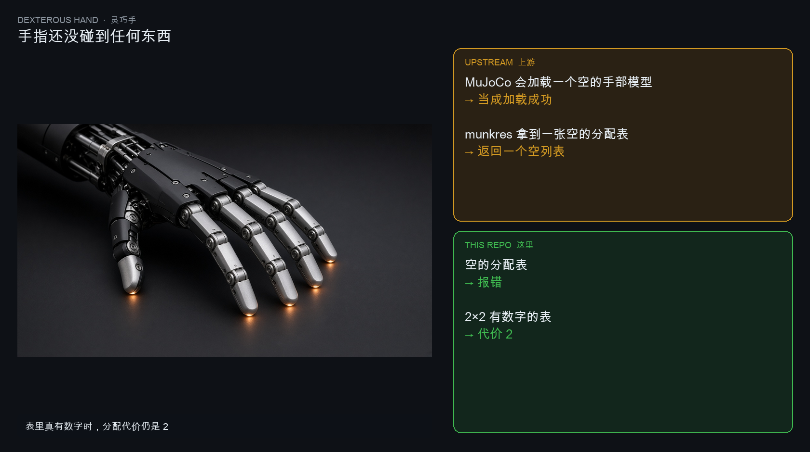

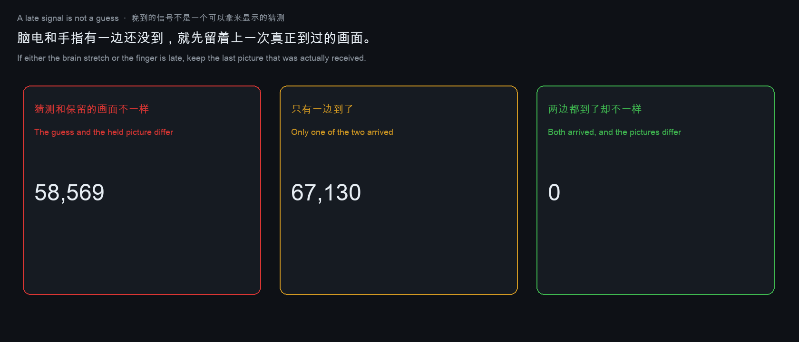

画面还知道自己有几步没更新了。两边都是这一步到的，画面是新的。有一边晚了，画面留着上一次到过的，年龄涨一步。中间三步两边都没到，画面不动，年龄涨三步。缺省值永远说自己是刚到的，留下的那一版不会这么说。

The picture also knows how many steps old it is. When both streams arrived this step, the frame is new. When one is late, the picture keeps the last arrival and grows one step older. Through a three-step burst with nothing arriving, the picture does not move and grows three steps older. A default always claims to be new. The held picture never makes that claim.

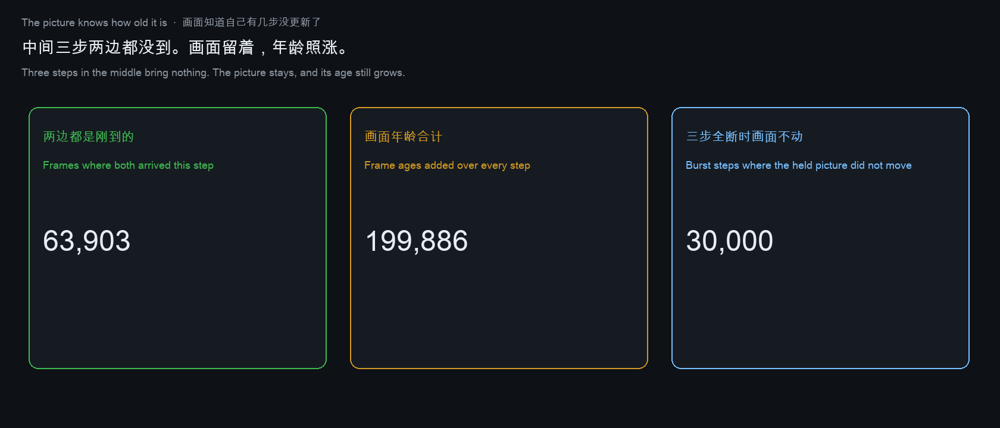

蒙也有蒙对的时候。手指晚了，猜的那一版每次都说握紧，握紧只占八分之一。留的那一版留着上一次到过的角度，一次都没到过就留着张开。只晚脑电时，两边蒙对差不多。只晚手指时，留下的蒙对六倍多。蒙对几回不是重点，重点是蒙对也记成蒙对，从不把蒙说成测到。

A guess is sometimes right. When the finger is late, the guessing picture always says closed, and closed is one case in eight. The held picture keeps the last angle that arrived, and starts open. When only the brain recording is late, the two match the truth about equally often. When only the finger is late, the held picture matches more than six times as often. How often is not the point. The point is that a lucky match is recorded as luck, never presented as a measurement.

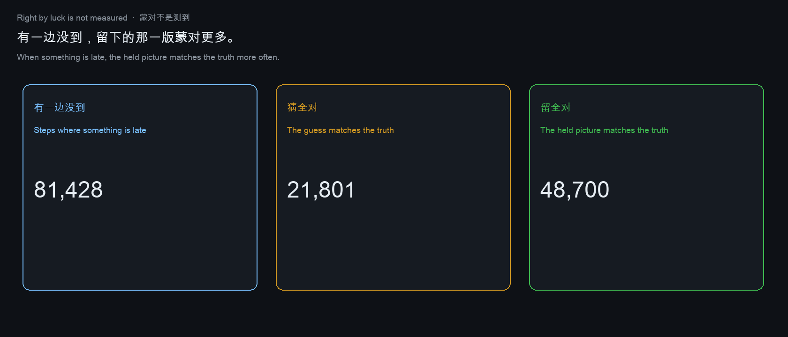

三步全断之后，第几步能追上，要数出来。两边都到的第一步，画面和真实对上，这才叫追上。一半左右第一步就追上，也有八十多段七步还没追上。追上之前那几步，留下的对得多，猜对得少。追上那一步，和真实不一样的次数是零。

After a three-step burst, the steps until the catch-up have to be counted. The first step on which both streams arrive is when the picture matches the truth, and only then has it caught up. About half catch up on the first step back, and more than eighty sessions still have not after seven steps. On the steps before that, the held picture matches more often and the guess less often. On the catch-up step itself, mismatches with the truth are zero.

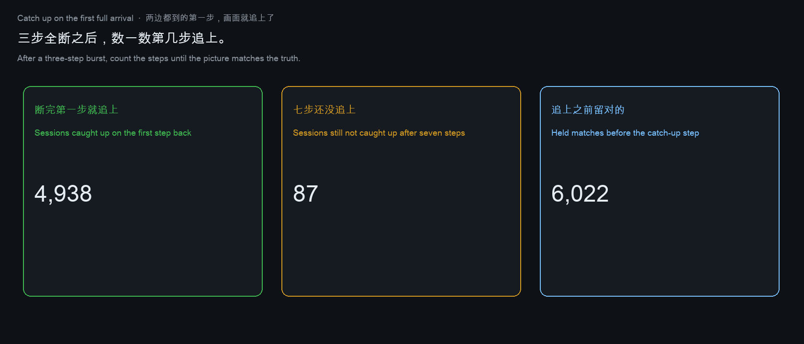

两路本来就不是一样快。手指三步来一次，中间两步没有新的角度。画面只在到过的那步更新，年龄零、一、二轮着数。十六步里，画面全新的最多六步。猜的那一版把十六步都当新的。

The two streams were never the same speed. The finger sends every third step, with no new angle in between. The picture updates only on an arrival, and the age cycles zero, one, two. At most six of sixteen steps are fully new. The guessing picture treats all sixteen as new.

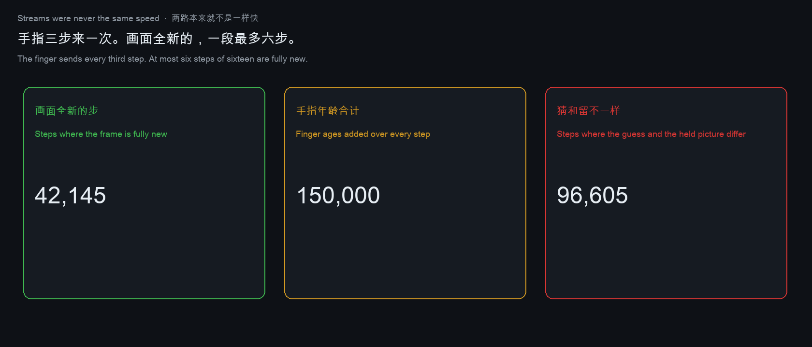

一间房里可以有两只手。各动各的，谁没到冻谁。一只全黑时，另一只照动上万步。先算谁后算谁，两只手看到的一样，换顺序变了的步数是零。

One room can hold two hands. Each moves on its own arrivals, and a miss freezes only that hand. While one is fully dark, the other still moves on its own steps. Either serving order shows both hands the same pair; steps changed by the order are zero.

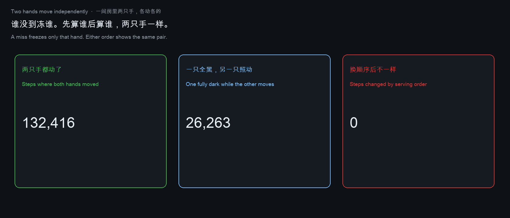

越晚，全新的越少。脑电和手指各晚一半时，两边都到的步只剩四分之一。一滴不晚时，猜和留一次都不分开，因为没有东西可猜。同一批随机数，阈值越高，晚得越多，两条线一边下一上。

The later the streams, the fewer new frames. When each misses half the time, both arrive on only a quarter of the steps. With nothing late, the guess and the held picture never part, because there is nothing to guess. The same uniforms under higher thresholds miss more, so one line falls while the other rises.

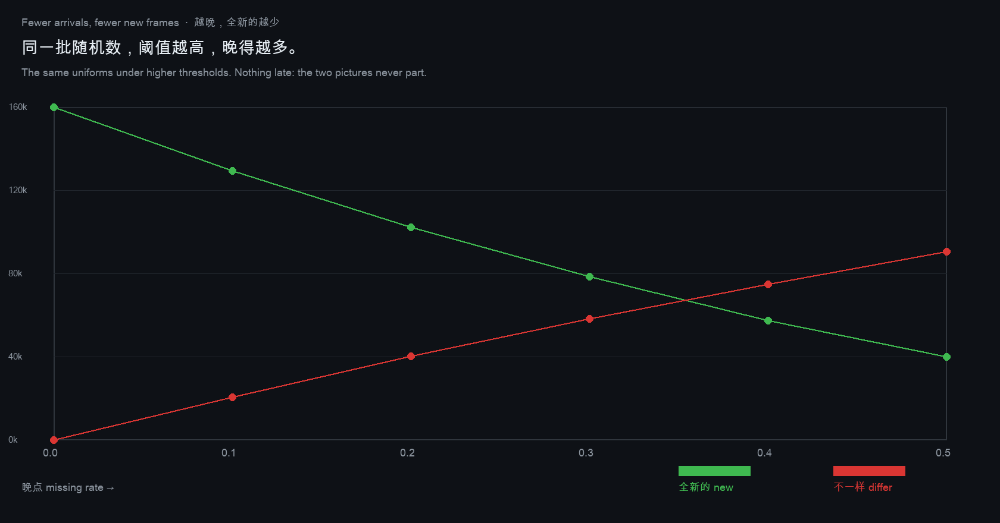

最坏能坏到哪，要排出来。十六步里晚八步，排在最后，画面年龄从一涨到八。怎么排，画面都老不过预算步数。猜的那一版照样每步都说新的。

How bad it can get has to be laid out. With eight late steps out of sixteen at the end, the frame age climbs from one to eight. No placement makes the frame older than the budget. The guessing picture still calls every step new.

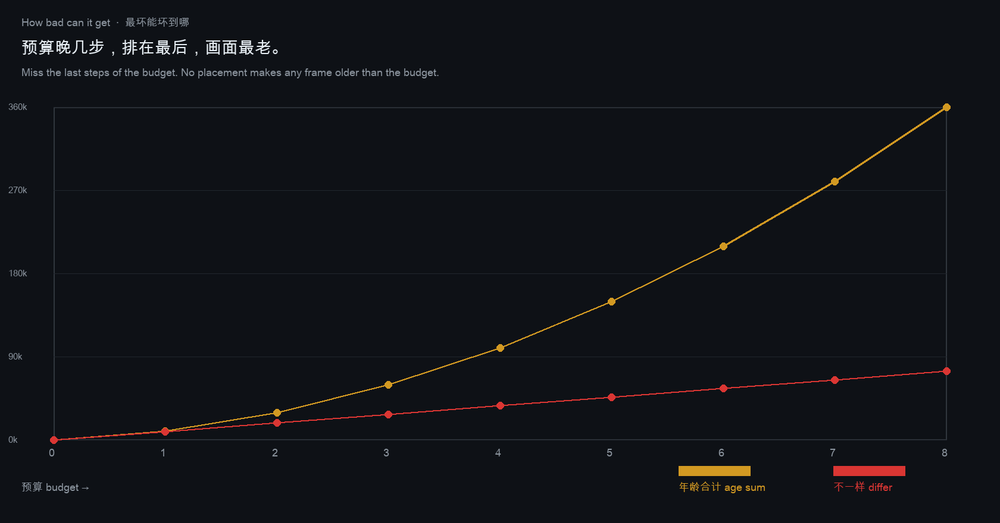

交出去的每一帧，事后要能从记录里算回来。记下每步到没到，再算一遍，两套算法步步一样。不一样的是零步。按帧收费，先对得上账。

Every frame handed over has to recompute from the record later. Log each arrival, recompute twice with two separate routines, and every step matches. Mismatches are zero. Billing per frame starts from a record that adds up.

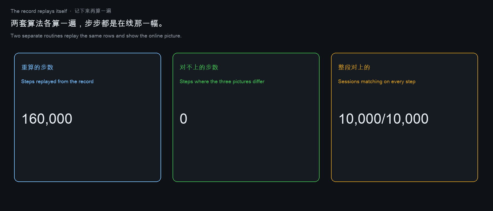

路可以越加越多。脑电加两根手指，三路都到，画面才是全新的。每加一路，全新的就打一次七折。猜的那一版不管几路，每步都说新的。

Streams can keep being added. With the brain recording and two fingers, the frame is new only when all three arrive. Each added stream multiplies the new-frame share by 0.7 again. The guessing picture calls every step new no matter how many streams there are.

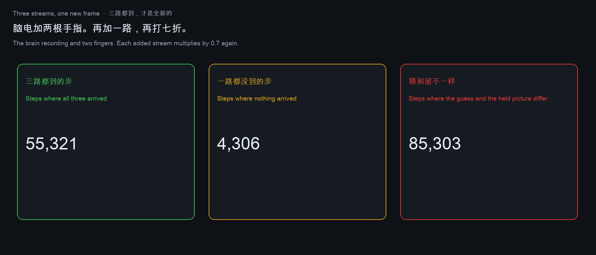

### 这些库在什么都没录上时仍会交回一个结果

机器人软件和脑电软件真的会调用它们。在正常输入上，它们是对的。什么都没录上时，返回值会被下一家当成一次测量。

Robotics code and biosignal code actually call these. On ordinary input they are right. When nothing was recorded, the return value becomes a measurement for the next program.

| 库 | 什么都没录上时 | 下一家会当成什么 |
|---|---|---|
| [MuJoCo 3.13.0](https://github.com/google-deepmind/mujoco) | 没有物体的模型也能载入。A model with no bodies still loads. | 没有身体，仍是一场场景。A scene with no bodies is still a scene. |
| [munkres 1.1.4](https://github.com/bmc/munkres) | `compute([[]])` 得到 `[]`（[issue 54](https://github.com/bmc/munkres/issues/54)）。 | 没有指派问题，看起来像指派已经做完。No assignment looks like a finished assignment. |
| [NumPy 2.4.6](https://github.com/numpy/numpy) | 范数 `0.0`，均值 `NaN`。 | 缺了一条向量，看起来像零向量。A missing vector looks like a zero vector. |
| [MNE-Python 1.9.0](https://github.com/mne-tools/mne-python) | 时长为 0。Duration 0. | 没录上的脑电，看起来像一段安静的录音。A missing recording looks like a quiet one. |
| [NetworkX 3.6.1](https://github.com/networkx/networkx) | 一张没有节点的图。A graph with no nodes. | 地图没载入，看起来像已经没有路要走。A map that never loaded looks like there is nowhere left to go. |
| [FilterPy 1.4.5](https://github.com/rlabbe/filterpy) | 没有测量的更新被接受，状态留在 `0.0`。 | 激光没返回，看起来像状态就是零。No lidar return looks like a state of zero. |
| [Foxglove MCAP](https://github.com/foxglove/mcap) | 一条没有消息的日志。 | 回放在沉默上继续。Playback continues through silence. |
| [ROS 2 rosbag2](https://github.com/ros2/rosbag2) | 一个没有消息的包。 | 机器人录下来的包也一样。Same for a robot’s recording. |
| [pybloom-live 4.0.0](https://github.com/joseph-fox/python-bloomfilter) | 没给键，也报告不在里面。 | 没给键，看起来像这个键不存在。No key was given, and it looks as if that key is absent. |
| Python `wave` | 没有波形的文件仍能打开。A file with no waveform still opens. | 有采样率、没有声音，播放器仍会播。A sample rate and no sound is still a file the player opens. |
| [SciPy 1.17.1](https://github.com/scipy/scipy) · [soundfile 0.14.0](https://github.com/bastibe/python-soundfile) | 读回来长度为零，采样率 8,000 Hz。 | 丢掉的交替声音仍是一个能读的文件。A dropped alternating tone is still a readable file. |
| [Pillow 11.3.0](https://github.com/python-pillow/Pillow) · [OpenCV 5.0.0](https://github.com/opencv/opencv) | 可以造出一张没有像素的图，非零像素数是 0。 | 什么都没看见，看起来像数到了零。Seeing nothing looks like a counted zero. |
| [Open3D 0.20.0](https://github.com/isl-org/Open3D) | 点云没有点，网格没有顶点。 | 没到的手部扫描仍是一个几何对象。A hand scan that did not arrive is still a geometry object. |

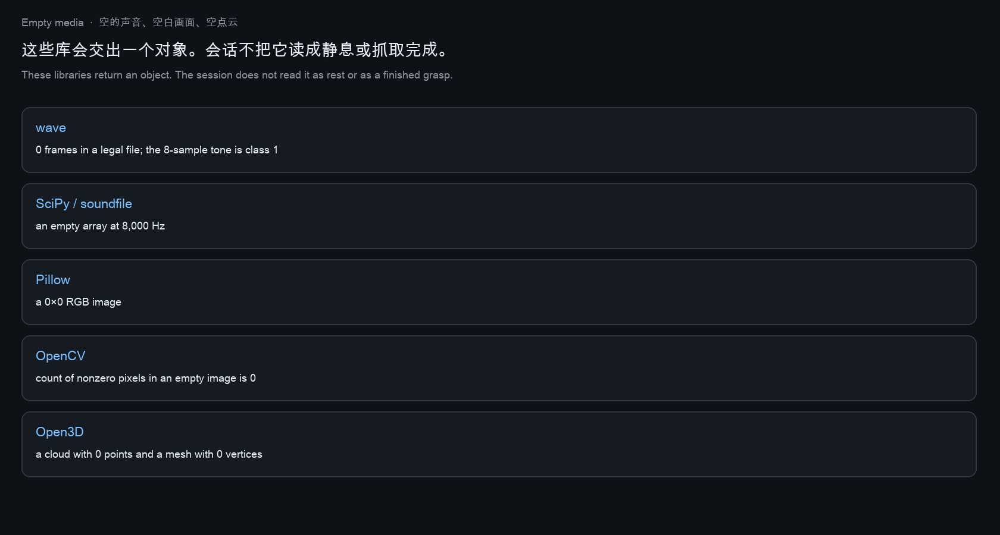

往前多看一步，会在折扣 `9/101` 上改主意。那张表是眼前收益更高、下一步掉下去。用分数精确算，改主意的地方就是这个分数。先把分数放大再迭代，会改得太早。这件事的证明在笔记里。页面上的奖励表就是这个形状。

Looking one step ahead changes the choice at discount `9/101`. The table pays more now and falls on the next step. Solved in exact fractions, that is where the choice flips. Scaling the fraction and iterating flips too early. The proof is in the note. The reward table on the page has this shape.

## 为什么是这一层，而不是再做一个模型

拿一轮美元基金去做视频世界模型的团队，时间花在数据、训练和机器人测试上。那是画未来的那一层，周期按季度算。我们不跟那一层抢同一张时间表。上面那条“选更短的，就会交回画完的场景”是写得下来、算得回来的，不需要再训练一个打分器。所以检查可以先交：一个网页，一次调用。生成画面的模型以后接到这层前面，它画出来的未来仍然要经过同一条规则。接上 Cosmos 或 V-JEPA，不改变这条规则。

A team that raises a dollar round to build a video world model spends the round on data, training, and a robot test. That layer draws the future, and its schedule is measured in quarters. We are not on that schedule. The fact that “pick the shorter route” returns the completed scene can be written down and recomputed, without training another scorer. The check can ship first: a web page, and one call. A generative model attached later still passes through the same rule. Attaching Cosmos or V-JEPA does not change the rule.

别的项目的 issue 是留给那个项目自己的缺陷的。这个页面不贴到别人的 issue 下面。某个库在什么都没录上时确有缺陷，而且能用测试修好，贡献的形式是一个 pull request。人能打开的地址就是上面的页面。

Issues on another project are for defects in that project. This page is not posted there. When a library really does the wrong thing on a missing recording, and a test can fix it, the contribution is a pull request. The address a person can open is the page above.

## 生意怎么做：先把检查做成服务

起点是把这一层检查做成可以调用的服务。游戏或机器人把脑电、手指的角度、画面发过来，服务交回给用户看的那一版，并说明哪一路没到、画面留在了哪一次。按核验过的帧收费。服务本身不训练，不存诊断，也不判断人的状态。

The starting point is this check as a callable service. A game or a robot sends the brain recording, the finger angles, and the picture. The service returns the version the user should see, and says which stream was late and which arrival the picture is showing. Billing is per verified frame. The service does not train, store a diagnosis, or judge anyone.

这门生意能成立，靠三条已经写下来的性质。第一，同一个输入永远是同一个输出，一个核和十个核一致。第二，一家晚到，不改另一家的画面，十六家排着来和轮着来完全相同。第三，它接在已有的世界模型前面，客户不用换模型。

The service rests on three facts that are written down. The same input always gives the same output, on one core and on ten. One tenant arriving late never changes another tenant's picture. And it sits in front of a world model the customer already runs, so nobody has to switch models.

有收入以后，做自己的东西：手、头戴的接入、游戏。路线不变：脑电传回什么，画面就按传回的部分实时生成；有一路没传到，画面先留着上一次到齐的样子。卖服务是起点，不是终点。

With revenue, we build our own things: the hand, the headset connection, the game. The direction does not change. The picture is generated in real time from what the brain recording sent back, and while a stream is late the picture stays with the last one that had everything. Selling the service is the starting point, not the destination.

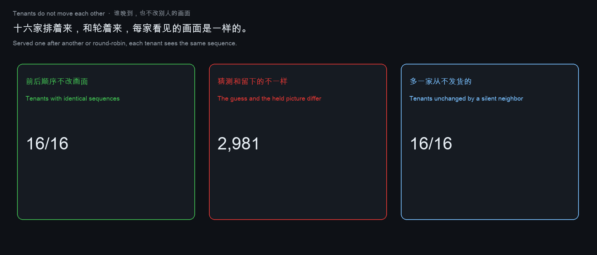

同一批随机数，两种芯片各数一遍。十万段、每段十六步，全新的和不一样的，CPU 和 GPU 数出来完全相同。这不是更快，是同一个答案换了一颗芯片。

One batch of random numbers, counted once on each of two chips. One hundred thousand sessions of sixteen steps: new frames and disagreements come out identical on the CPU and the GPU. This is not about speed. It is the same answer on another chip.

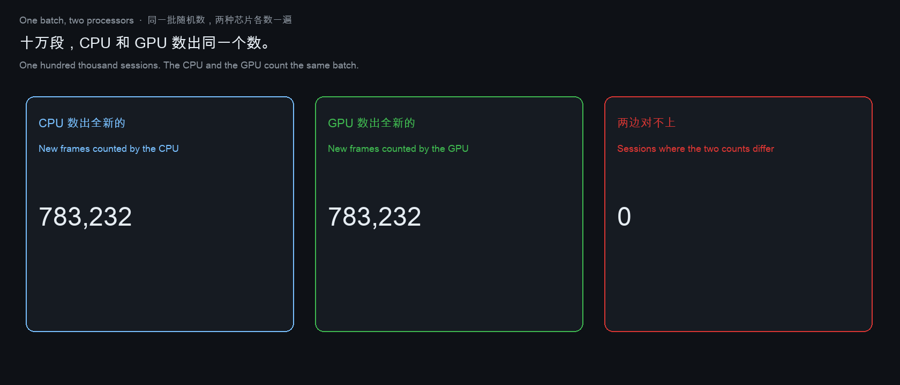

## 谁在做：能点开验证的上游记录

这一版一晚上能交出来，因为交出去的不是生成器，是检查：一个网页，一次调用，每个结果都能重算。生成画面的那一层按季度算时间，我们不在那张时间表上。

This version can ship in a night because what ships is not the generator. It is the check: a web page, one call, every result recomputable. The layer that draws the future is measured in quarters. We are not on that schedule.

上游的记录每条都能点开。CP2K 有一条已合并的修复：[FIST 偶极与周期性电场符号](https://github.com/cp2k/cp2k/pull/6064)。DFTB+ 有一条正在评审：[晶格步长投影](https://github.com/dftbplus/dftbplus/pull/1920)。已经合并的还有 PySCF 的两条（[3450](https://github.com/pyscf/pyscf/pull/3450)、[3451](https://github.com/pyscf/pyscf/pull/3451)）、[OpenMM 5426](https://github.com/openmm/openmm/pull/5426)、[phonopy 988](https://github.com/phonopy/phonopy/pull/988)、[pymatgen-core 144](https://github.com/materialsproject/pymatgen-core/pull/144)、[xtb 1450](https://github.com/grimme-lab/xtb/pull/1450)。没有抬头，合并就是合并，评审就是评审。

Every upstream record below can be opened. CP2K has one merged fix: [FIST dipole and periodic electric-field signs](https://github.com/cp2k/cp2k/pull/6064). DFTB+ has one under review: [lattice step projection](https://github.com/dftbplus/dftbplus/pull/1920). Merged elsewhere: two in PySCF ([3450](https://github.com/pyscf/pyscf/pull/3450), [3451](https://github.com/pyscf/pyscf/pull/3451)), [OpenMM 5426](https://github.com/openmm/openmm/pull/5426), [phonopy 988](https://github.com/phonopy/phonopy/pull/988), [pymatgen-core 144](https://github.com/materialsproject/pymatgen-core/pull/144), [xtb 1450](https://github.com/grimme-lab/xtb/pull/1450). No inflated titles. Merged is merged, and under review is under review.

## 今晚交出去的是什么

一次调用，三种结果。它坐在产品已经在跑的规划前面。

One call, three outcomes. It sits in front of a planner the product already runs.

长什么样，看这张图。脑电和手指先进检查，再进世界模型，再出来画面和声音。检查下面接着记录，记录重算一遍，对上了才算完。

What it looks like is in this diagram. The brain recording and the finger enter the check first, then the world model, then come out as picture and sound. Below the check hangs the record; the replay has to match before the work is done.

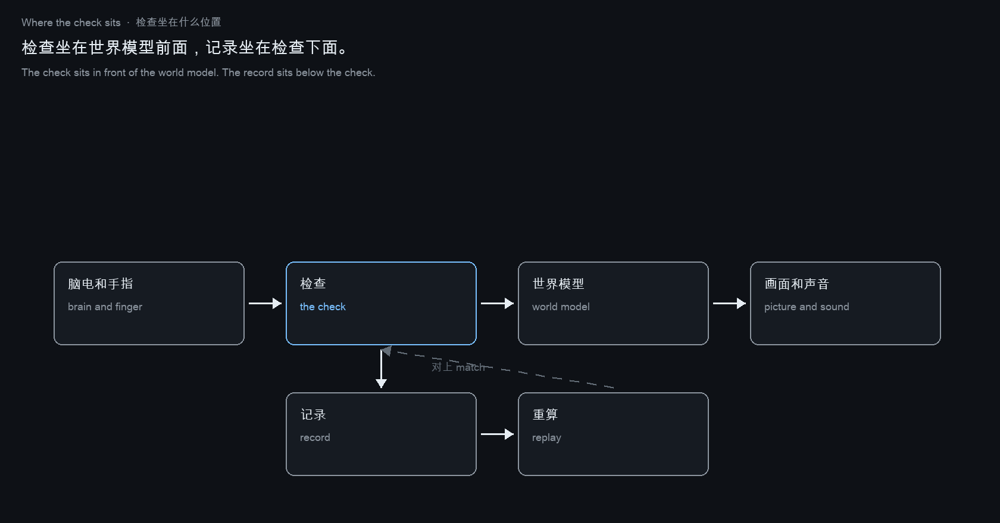

用素材库里的树、石头、帐篷，画出一片营地。给用户看的那只手，只在脑电和手指都到了的时候往前走，停在营地中间。猜的那只手每步都走，走到了石头旁边。素材是 Kenney 的自然套件，可以自由使用。这还不是发布出去的关卡。

The same clearing, drawn from trees, a rock, and a tent in the model pack. The hand the user sees walks forward only when both the brain recording and the finger have arrived, and it stops in the middle of the camp. The guessed hand walks on every step and ends beside the rock. The models are Kenney's nature kit, free to use. This is not a shipped level yet.

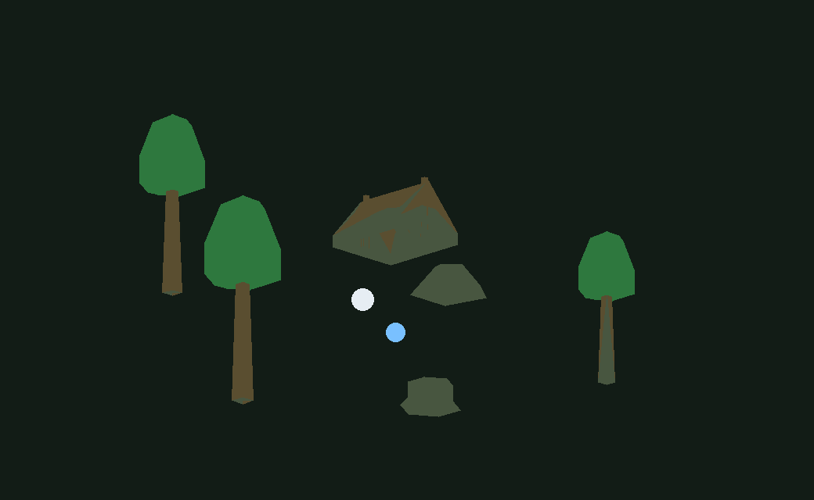
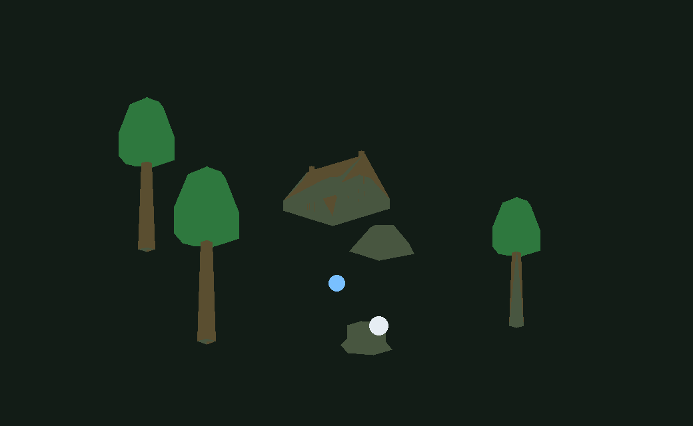

营地里还站着一个人，蓝点，不走。给用户看的那只手停在他前面。猜的那只手走过他，最后站进树桩里。一万次里，猜的手每次都走到他面前；给用户看的手只有少数几次走到。猜的手走到树桩上、角度又没到，就会被画成已经握住木头。给用户看的手一次都没有。页面上可以自己走，同时响起贝多芬第十五奏鸣曲开头的八秒。有一路晚了，曲子继续，不换。这不是治疗用的音乐，蓝点也不是某一个人的记录，握住树桩也不是从人身上量到的角度。这个人没传来的时候，画面不把他带到你面前。猜的画面会。两张账单写的不是同一件事。没发生的那一行，不开账。[打开页面](https://shaneraphel.github.io/aletheia-worldtick/)。

Someone else stands in the camp, the blue dot, and does not walk. The hand the user sees stops before them. The guessed hand walks past them and ends inside the stump. On ten thousand tries the guessed hand reaches them every time. The hand the user sees reaches them only on a minority of tries. When the guessed hand is on the stump and the finger angle did not arrive, the picture draws it as a grip on the wood. The hand the user sees is never drawn that way. On the page you can walk it yourself, with the opening eight seconds of Beethoven’s Piano Sonata No. 15. When one stream is late, the piece keeps playing and does not switch. It is not treatment music, the blue dot is not a record of a particular person, and the grip on the stump is not an angle taken from a hand. When their signal does not arrive, the picture you see does not walk them over to you. The guessed picture does. The two bills do not say the same thing. A line for something that did not happen is not charged. [Open the page](https://shaneraphel.github.io/aletheia-worldtick/).

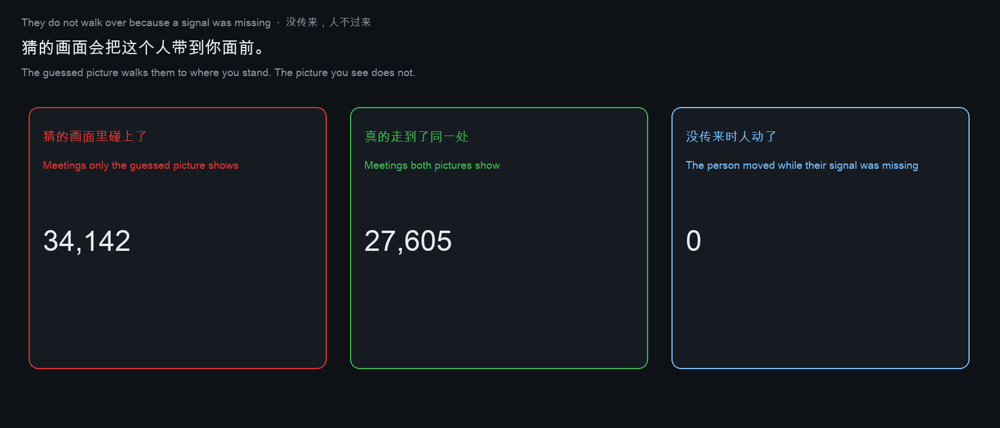

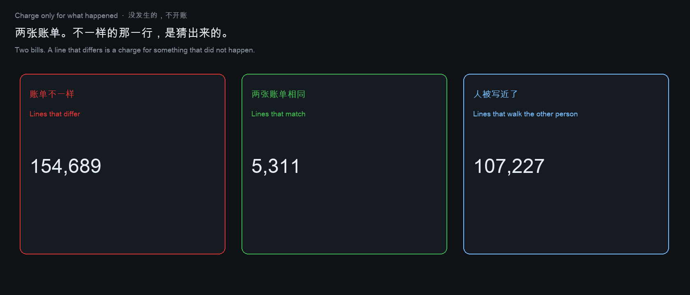

在不在一起，看的是两个人在路上隔几步。隔两步以内，才说站在一起。每步都走的那只手会从人身边走过去，所以它说你们在一起的次数更少。留下的画面还有很多步停在他旁边。人没传来的时候，他不会自己走过来；你的手到了，你可以自己走过去。猜的画面会在他没传来时把他拉近。这不是某一个人的记录，两步也不是一种心情。[打开页面](https://shaneraphel.github.io/aletheia-worldtick/)。

Whether two people are beside each other is how many steps apart they are on the path. Two steps or fewer counts as beside each other. The hand that moves every step walks past the other person, so it says you are together less often. The picture you see still spends many steps next to them. When their signal has not arrived, they do not walk over. When your hand has arrived, you can walk over yourself. The guessed picture pulls them closer while their signal is missing. This is not a record of a particular person, and two steps is not a feeling. [Open the page](https://shaneraphel.github.io/aletheia-worldtick/).

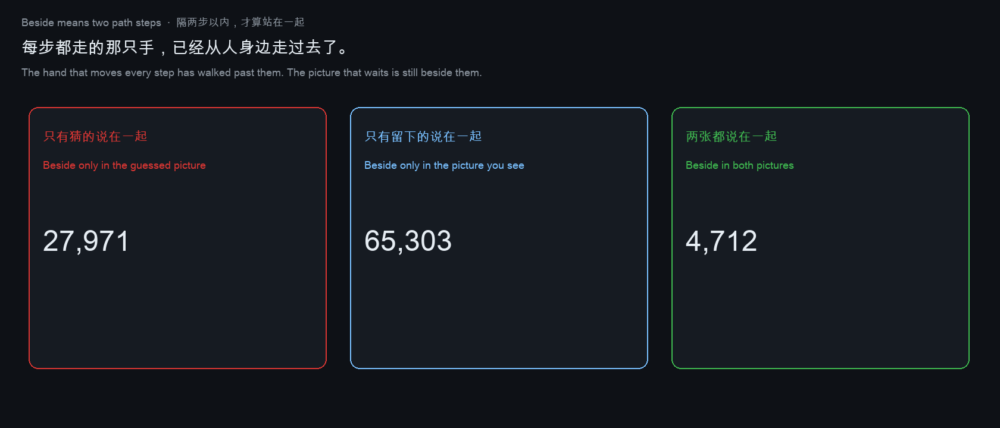

对方看见的你，是最后一次送到他那边的位置，不是每步都在走的那只手。那只手每一段都有固定的五步说自己在他旁边，然后走到树桩上。送到的位置说在旁边的次数少得多，而且不会比传感器已经走到的地方更远。页面上的橙圈就是送到的位置。你走了、这一步没送到，橙圈留在后面。[打开页面](https://shaneraphel.github.io/aletheia-worldtick/)。

What the other person sees of you is the last place that was delivered, not the hand that moves every step. That hand spends five fixed steps of every session beside them, then stands on the stump. The delivered place says you are beside them less often, and it never runs ahead of where the sensors have already gone. On the page the amber ring is the delivered place. When you move and that step is not sent, the ring stays behind. [Open the page](https://shaneraphel.github.io/aletheia-worldtick/).

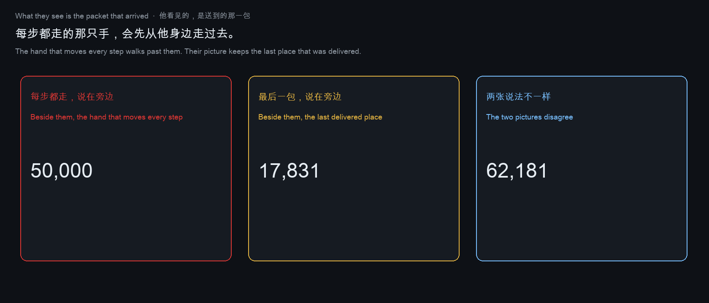

位置没变，就还是这一张。同一批送到对方的位置里，大多数步并没有换地方。包到了、人还在原地，那一包不是一张新画面。世界模型要是每一拍都再画一次，画的还是同一个位置。页面上可以送一次已经站着的位置：橙圈本来就在白点上时，它不动。[打开页面](https://shaneraphel.github.io/aletheia-worldtick/)。

A repeated place is not a new picture. On the same deliveries, most steps do not move the place. A packet that arrives while the person is still standing there is not a new picture. A world model asked to draw again on every tick would be drawing the same place. On the page you can send the place where you are already standing. When the amber ring is already on the white dot, it does not move. [Open the page](https://shaneraphel.github.io/aletheia-worldtick/).

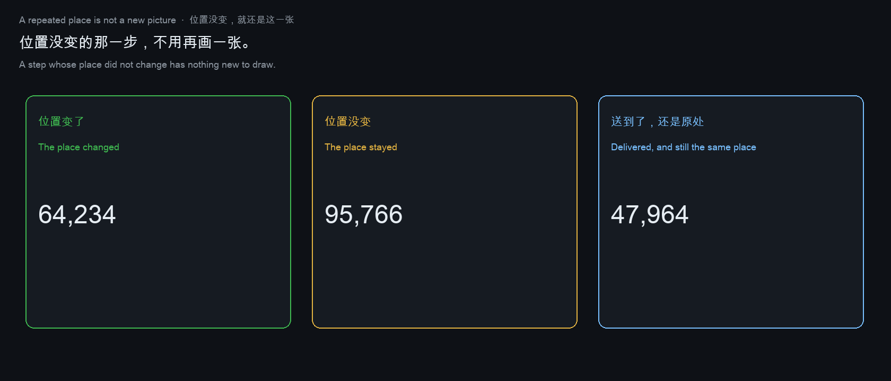

你量到的距离，和他量到的，不是同一个数。你量的是白点离蓝点多远。他量的是橙圈离蓝点多远。同一万段里，这两个距离有 27,143 步不一样。其中 26,761 步是你比他所以为的更近。只有 382 步是他以为你更近：你已经走过他，送到的位置还在近的一侧。另有 49 步，送到的位置落在后面，两边的距离却一样，因为两个位置到他是同样远、方向相反。页面上每走一步都会写出这两个数。[打开页面](https://shaneraphel.github.io/aletheia-worldtick/)。

The distance on your screen and the distance on theirs are not the same number. You measure how far the white dot is from the blue dot. They measure how far the amber ring is from the blue dot. On the same ten thousand sessions those two distances differ on 27,143 steps. On 26,761 of them you are closer than they think. On 382 they think you are closer: you have walked past them, and the place that was sent is still on the near side. On another 49 steps the sent place is behind and the distances still match, because the two places are equally far from them in opposite directions. Every step on the page states both numbers. [Open the page](https://shaneraphel.github.io/aletheia-worldtick/).

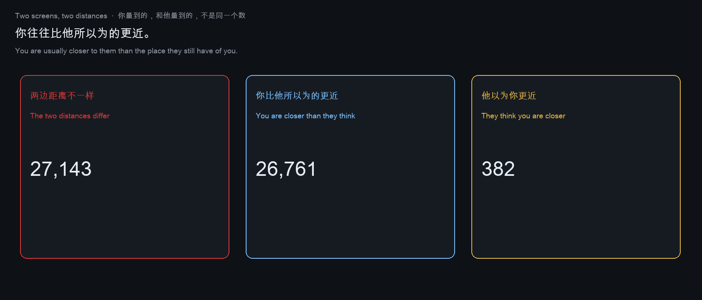

人一次只走一步。送到对方那边的时候，画面可以一下跳过中间的几步。同一万段里，有一万多次是这样跳过去的，被跳过的位置一共一万两千多步。最远的一次跳了八步。把这些位置补画成一段走路，画的是没有送到的路。页面上先连着走几步不送，再送到，橙圈会一下子跳过去。[打开页面](https://shaneraphel.github.io/aletheia-worldtick/)。

The person moves at most one step at a time. When a late packet is delivered, their picture can jump over the steps in between. On the same ten thousand sessions that happens thousands of times, and the skipped places add up to more than twelve thousand. The farthest jump is eight steps. Drawing those places in as a walk would show a path that was not sent. On the page, walk several steps without sending them, then send: the amber ring jumps. [Open the page](https://shaneraphel.github.io/aletheia-worldtick/).

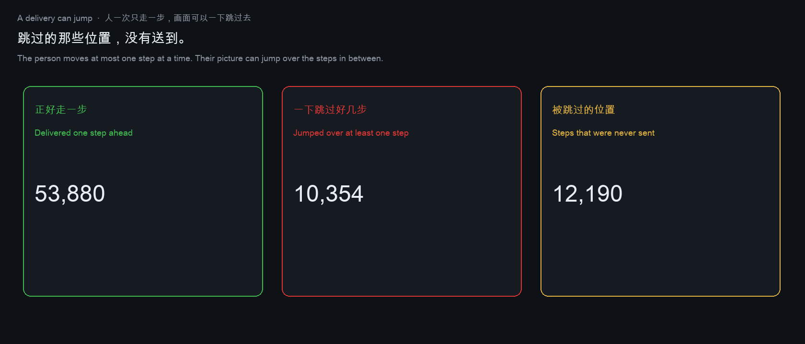

这一下合上的地方，是你当时站的地方。对方的画面如果还停在后面，把这一下画在那里，就合在一个你已经离开的位置上。每步都走的那只手，有九百多次在合上的时候正站在树桩里。你真正站的地方，一次都没有在树桩里合上。这不是从人身上量到的角度。页面上按「这一下合上了」：橙圈还在后面时，这一下不能画在橙圈上。[打开页面](https://shaneraphel.github.io/aletheia-worldtick/)。

The hand closed where you were standing. If their picture is still behind, drawing the closure there closes a place you have already left. On several hundred of these closures the picture that moves every step is standing inside the stump. The place you had actually reached never was. These are not angles from a hand. On the page, press “the hand closed.” When the amber ring is still behind, the closure does not belong on the ring. [Open the page](https://shaneraphel.github.io/aletheia-worldtick/).

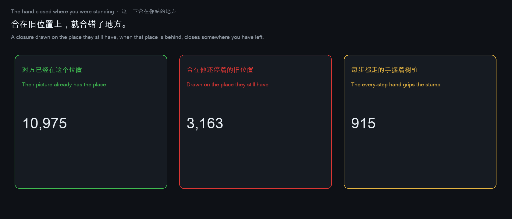

他看见的握法，是上次送到的那一下。你已经合上，他还可以看着张开。你已经张开，他还可以看着合上。送到的那一步，两种握法才变成一样。这不是从人身上量到的角度。页面上可以先合上、再张开，橙圈那边仍留着上次送到的握法；再按送到，两边才一样。[打开页面](https://shaneraphel.github.io/aletheia-worldtick/)。

The grip they see is the one from the last delivery. You can have closed while they still show an open hand, and you can have opened while they still show a closed hand. On a step that was sent, the two grips match. These are not angles from a hand. On the page you can close and then open. Their side keeps the grip from the last time it was sent, until you send again. [Open the page](https://shaneraphel.github.io/aletheia-worldtick/).

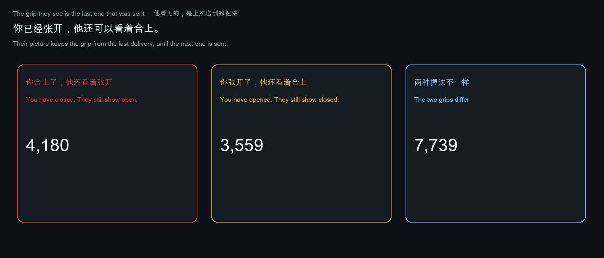

跳过的那几步，不能涂成最后的握法。最后的握法只属于跳到的那个位置。同一批被跳过的位置里，有两千多次会被涂反：当时张开的被涂成合上，当时合上的被涂成张开。这不是从人身上量到的角度。页面上橙圈一下子跳过去的时候，中间那几步的握法不是现在这一下。[打开页面](https://shaneraphel.github.io/aletheia-worldtick/)。

A skipped place keeps the grip it had. The grip at the end of a jump belongs to the place the jump lands on. On the same skipped places, painting them with that final grip gets some of them backwards: an open place painted closed, or a closed place painted open. These are not angles from a hand. On the page, when the amber ring jumps, the grips in between are not the grip it has now. [Open the page](https://shaneraphel.github.io/aletheia-worldtick/).

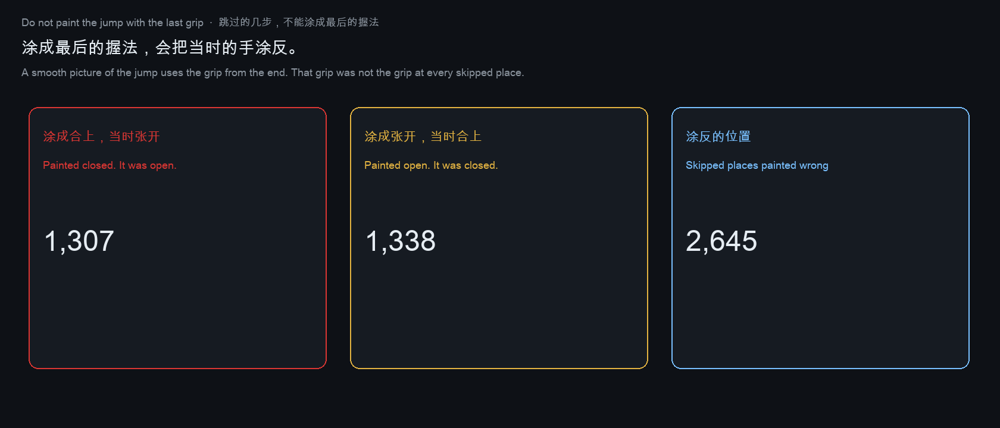

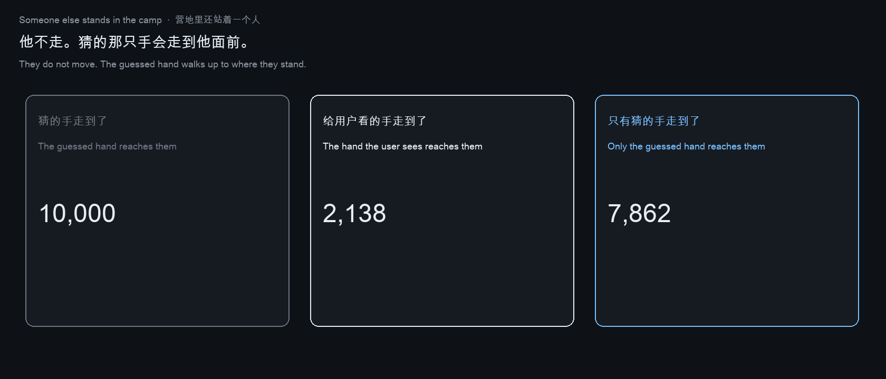

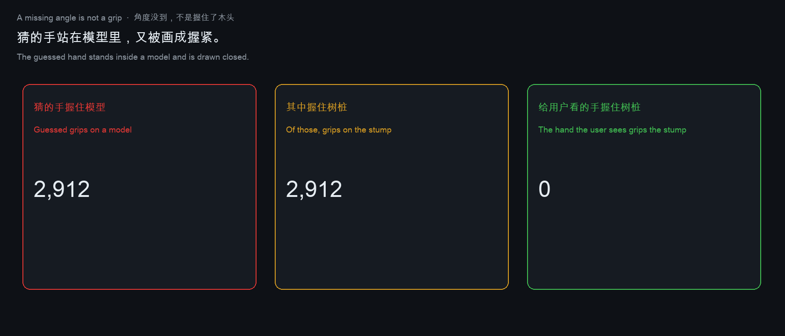

| 调用 | 人拿到的 |
|---|---|
| `measure` | 只用已经送到的信息往下走。两条路一样长时，走只经过看见的地面的那条。脑电没传全，不写成零。手指角度没到，不画成已经握紧。脑电和手指有一边晚了，画面留在上一次两边都到过的样子。 |
| `impute` | 旁边的对照。同一个规划，在场景被补完之后会怎么走。用来给人看两边不一样。正式交出去的是上一行。 |
| 停住 | 什么都没送来。不交回零，不交回一个里面什么都没有的列表，也不交回一个会悄悄传下去的非数。 |

页面上能对上的几件事：走廊中间没看见，补完以后会走进障碍，只按看见的会停住；八段脑电写成零，会把动作读成没动；奖励表往前看一步，和只看眼前，选出的动作不同；左耳右耳的声音在这一小段没传全时速度不变；一根手指的角度没到时，不画成握紧；脑电和手指有一边晚到时，给用户的画面先留着；两家住户各留各的画面，谁没来只影响谁；画面上还有年龄，几步没更新就涨几步；蒙对也记成蒙对，页面上按一步看一步；断完第几步追上，页面上断三步再一步一步来；手指三步来一次，页面上按一步看一步，全新的最多六步；一间房里两只手各动各的，谁没到冻谁；三档晚点各走十六步，越晚全新的越少；三档预算，看十六步的年龄，最老就是预算；来一步记一行，重算一遍步步一样；三块各显示到没到，三路都到才是全新的；同一批随机数两种芯片各数一遍，页面上只说结论。

On the page: the middle of the corridor was not seen, the completed walk enters an obstacle, and the walk that stays with what was seen stops. Eight brain samples written as zeros are read as no movement. On the reward table, looking one step ahead and looking only at the current row pick different actions. The left-right clicks do not change speed when the stretch has not arrived whole. A finger whose angle has not arrived is not drawn closed. When either the brain recording or the finger is late, the picture the user sees stays with the last one that had both. Two tenants keep separate pictures, and a miss moves only the tenant that missed. The picture also shows its age: each step without an update adds one. A lucky match is recorded as luck; the page shows one step at a time. After a burst, break three steps and walk back one at a time to see when it catches up. With the finger scheduled every third step, press step by step: at most six frames are new. Two hands in one room move independently; a miss freezes only that hand. Three missing rates, sixteen steps each: the later, the fewer new frames. Three budgets, sixteen ages each: the oldest is the budget. Log one row per step and replay it: every step matches. Three blocks show what arrived; the frame is new only when all three arrive. One batch is counted on two chips; the page states the result.

这次没有训练好的视频模型，没有头戴设备的开发包，没有机器人成功率，也没有治疗效果。

Not in this delivery: a trained video model, a headset SDK, a robot success rate, or a treatment effect.

[`site/index.html`](site/index.html) 在浏览器里做完这些，不需要账号。GitHub Pages 用本仓库发布。

[`site/index.html`](site/index.html) runs this in the browser and asks for no account. GitHub Pages serves it from this repository.

```bash
make check
python3.12 show_story.py
python3.12 show_policy.py
```

`make check` 把笔记里的次数重新算一遍。次数在 `results/`。和每篇论文逐项对照在 [`paper/paper.md`](paper/paper.md)。要并排调用那些库，用 `requirements-show.txt` 里的版本。

`make check` recomputes the counts in the note. They live in `results/`. The comparison with each paper is in [`paper/paper.md`](paper/paper.md). Side-by-side callers need the versions in `requirements-show.txt`.

## 这层检查坐在谁前面

| 项目 | 它交出来的 | 接到这层以后 |
|---|---|---|
| [V-JEPA 2.1](https://arxiv.org/abs/2603.14482) | 预测出来的画面碎片 | 不把预测出来的一块当成已经看见 |
| [Cosmos](https://github.com/nvidia-cosmos/cosmos-predict1) | 预测的下一帧 | 同一条，用在画出来的未来上 |
| [LaBraM](https://arxiv.org/abs/2405.18765) | 补出来的脑电 | 不把写成零的丢包读成“人没动” |
| [NetworkX](https://github.com/networkx/networkx) | 整张图上能走到的全部 | 只走已经看见的下一步，不把走完的路当成现在 |
| [MNE-Python](https://github.com/mne-tools/mne-python) | 一段录音 | 一个采样都没有时停住 |
| [MuJoCo](https://github.com/google-deepmind/mujoco) | 一个模型 | 没有物体时停住 |
| [Foxglove MCAP](https://github.com/foxglove/mcap) | 一条日志 | 一条消息都没有时停住 |
| [ROS 2 rosbag2](https://github.com/ros2/rosbag2) | 一个录包 | 一条消息都没有时停住 |
| [ROS map_server](https://wiki.ros.org/map_server) | 一张地图 | 没测到的地方保持没测到 |
| [FilterPy](https://github.com/rlabbe/filterpy) | 一次状态更新 | 没有测量时停住 |

各个文件格式上的检查在 `locks/`。索引是 [`ATLAS.md`](ATLAS.md)。

## 文件

| 路径 | 它做什么 |
|---|---|
| `tick.py` | 只按已经送到的信息走下一步 |
| `datalog.py` | 把路走完。那是场景被补完以后才会交回的结果 |
| `complete.py` · `decode.py` · `policy.py` | 三种补法：地图、脑电、奖励表 |
| `partition.py` | 两条路谁包含谁；一样长时留哪一条 |
| `signfill.py` | 不能为负的信号，和有正有负的电压，写成零以后各读成什么 |
| `decisive.py` | 只堵住第一次撞上的地方，再规划 |
| `askdepth.py` | 要问多少次，路才清楚 |
| `session.py` | 脑电没传全时声音不动；没看见的地方不画成已经抓完 |
| `fleet.py` | 同一批地图，一个核和多个核，结果相同 |
| `media.py` | 没有波形的声音、没有像素的图、没有点的扫描 |
| `pace.py` | 左耳右耳的声音：这一小段传全了才允许变速 |
| `room.py` | 画面停在摄像机看见的最后一处 |
| `attempt.py` | 听见人在动，并不等于走进还没看见的地方 |
| `ledger.py` | 没传全的那段不记类别；手停在已经看见的地方 |
| `company.py` | 一个人只有被看见才画出来 |
| `framecheck.py` | 没有新的观测，再画一次，像素不变 |
| `clock.py` | 没传全的那段，速度和画面都不动 |
| `near.py` | 离房间里的人有多远：只走看见的地面，和把没看见的当成能走 |
| `reel.py` | 速度可以变，画面仍停在这一帧 |
| `aperture.py` | 关节角度没到，不把这根手指画成已经握紧 |
| `late.py` | 脑电和手指有一边晚到，画面先留着上一次到齐的样子 |
| `tenant.py` | 谁晚到，也不改另一家的画面 |
| `stale.py` | 画面知道自己有几步没更新了 |
| `luck.py` | 蒙对不是测到 |
| `catchup.py` | 断完之后，数第几步追上 |
| `rate.py` | 手指三步来一次，画面全新的最多六步 |
| `duo.py` | 一间房里两只手，各动各的 |
| `dose.py` | 越晚，全新的越少 |
| `worst.py` | 预算晚几步，画面最老几步 |
| `replay.py` | 记下来再算一遍，步步一样 |
| `trio.py` | 三路都到，画面才是全新的 |
| `system.py` | 检查、模型、记录长什么样 |
| `gpurun.py` · `gpucount/` | 同一批随机数，CPU 和 GPU 各数一遍 |
| `gate.py` | 交给画面的那一次调用 |
| `scene.py` · `resources/kenney/` | 用素材库里的树和石头把营地画出来 |
| `visitor.py` | 营地里的另一个人站着不走 |
| `grip.py` | 角度没到，不是握住了树桩 |
| `approach.py` | 这个人没传来，画面不把他带到你面前 |
| `bill.py` | 没发生的那一行，不开账 |
| `beside.py` | 隔两步以内才算站在一起。每步都走的手会从人身边走过去 |
| `relay.py` | 对方看见的，是送到的那一包，不会跑在传感器前面 |
| `once.py` | 位置没变，就还是这一张 |
| `apart.py` | 你量到的距离，和他量到的，不是同一个数 |
| `leap.py` | 人一次只走一步。送到的画面可以跳过中间 |
| `clasp.py` | 这一下合在你当时站的地方 |
| `latch.py` | 他看见的握法，是上次送到的那一下 |
| `blend.py` | 跳过的几步留着当时的握法，不能涂成最后那一下 |
| `site/index.html` | 浏览器里的页面 |
| `paper/paper.md` | 理论、它是怎么被发现的、和每篇参考文献的对照 |
| `tests/test_precision.py` | 这些关系一旦变了，测试就失败 |
| `kits/README.md` | 本机的启动器、自然场景模型和钢琴录音放在哪 |

## 本机已经放好的画面和音乐

开放世界的三维场景还不是一个发布出去的虚幻关卡。这台 Mac 上已经装了 Epic 启动器，解压了两套可以自由使用的自然场景模型，并放了贝多芬《第十五钢琴奏鸣曲》的一份公有领域录音，四个乐章。虚幻编辑器本体没有安装。4.27 是虚幻 4 的最后一版，它对 Mac 的说明停在 Big Sur，而这台电脑是 Apple Silicon 上的 macOS 26，剩下的容量也不该拿去装一整套编辑器。要拿到引擎，打开启动器并登录。模型、录音和许可写在 [`kits/README.md`](kits/README.md)，文件本身不进 GitHub。

The 3D scene is not a shipped Unreal level. This Mac already has the Epic Games Launcher, two freely usable nature model packs, and a public-domain recording of Beethoven’s Piano Sonata No. 15, four movements. The Unreal Editor itself is not installed. 4.27 is the last Unreal Engine 4, and its Mac notes stop at Big Sur. This computer is Apple Silicon on macOS 26, and the free space should not be spent on a full editor. An engine build means opening the launcher and signing in. Models, the recording, and the licenses are in [`kits/README.md`](kits/README.md). The files stay off GitHub.

## License

MIT
